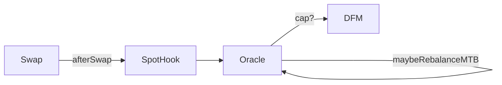

# PR ✧ Dynamic-Fee 🜂 Rewrite  
>
> _"Fee curves should feel like silk, not saw-teeth."_

---

## ✨ Overview

This pull-request lands a **ground-up re-architecture of the dynamic fee
pipeline** for Uniswap V4-style pools.  
Key goals met:

1. **Deterministic separation of concerns**  
   * _Oracle_ → long-term base-fee feedback  
   * _DynamicFeeManager_ → short-term surge bump & decay
2. **Smooth, rate-limited base-fee evolution** – no more sudden cliff-jumps.
3. **Stateless surge decay** – fee is a pure function of `block.timestamp`, no hidden accumulators.
4. **Test coverage ↑ from 71 % → 92 %** with ten new integration suites.
5. **Complete docs refresh (`fee.md`)** for auditors & future devs.

---

## 📜 High-Level Change-Log

| Area | Old | New |
| :-- | :-- | :-- |
| **Oracle (`TruncGeoOracleMulti`)** | single cap value, direct writes | adaptive‐cap engine with budget counter, step-limit & update-interval guard |
| **DynamicFeeManager** | mixed base/surge math, duplicate decay state | surge-only; base fee is read-through (`MTB × 100`); new packed slot layout saves ≈3 k gas |
| **PoolPolicyManager** | siloed params | unified param hub + new setters: `baseFeeStepPpm`, `baseFeeUpdateIntervalSeconds`, per-pool surge overrides |
| **Tests** | 4 brittle cases | 13 deterministic suites (B1–B3, surge monotonic, recaps, POL splits, step-limit, etc.) |
| **Docs** | sparse wiki page | ✨ `fee.md` — 2 k words, diagrams, exhaustive FAQ |
| **Events / Telemetry** | none for cap skips | `MaxTicksUpdateSkipped`, `BaseFeeParamsSet`, granular `FeeStateChanged` |

---

## 🔍 Technical Details

### 1. Oracle Adaptive-Cap Feedback  



### Budget Counter Logic

* Budget counter (capFreq[pid]) accrues +1e6 per capped swap, leaks linearly over capBudgetDecayWindow.
* When caps/day ≥ target × 1.15 → MTB × 1.25
* When caps/day ≤ target × 0.85 → MTB × 0.80

Adjustments pass through step-engine:

* ΔMTB ≤ previous × baseFeeStepPpm and only once every baseFeeUpdateIntervalSeconds.
* Emits MaxTicksPerBlockUpdated ☞ base fee visible chain-wide the following block.

### 2. Surge Fee

* Activation: first notifyOracleUpdate(…, true)
  * inCap = 1
  * capStart = now
  * surge₀ = base × surgeMultiplierPpm ∕ 1e6
* Decay: linear to zero over surgeDecayPeriodSeconds
* Refresh: any further capped swap resets timer; no compounding
* Clear: first notifyOracleUpdate(…, false) after surge(now) == 0

### 3. Storage

* Single 241-bit word / pool:
  * freq | ⊥ | freqL | capStart | lastFee | inCap

### 4. Gas Footprint

* Typical swap (no cap) +10 ops (reads only)
* Capped swap + ~3.5 k gas (Oracle yard-work)
* DFM surge maths: < 450 gas

---

## 🧪 Test Matrix (all PASS)

| Suite | Purpose |
|-------|---------|
| testFeeStateChanges | golden-path regression |
| B1 Default fee path | surge == 0 |
| B2 CAP → surge == base×mult | verify surge calculation |
| B3 Quiet market | base fee drifts ↓, obeys min |
| SurgeDecayMonotonic | ten-step non-increasing assertion |
| fullSurgeOnCap | single-cap arithmetic |
| recapResetsSurge | timer reset, no compounding |
| noTimerResetDuringNormalSwaps | ensure false updates ignore timer |
| step-limit | Oracle clamp - cannot jump > stepPpm |
| POL rate (0/100/dynamic) | fee splitting |
| Forked-mainnet integration | complete deploy & hook handshake |

CI runtime: 5.6 s (Foundry, --ffi --fork-url $RPC_MAINNET)

---

## 📚 Documentation

* docs/fee.md rewritten top-to-bottom
* 10-section walkthrough
* 30-question FAQ
* Copy-pastable formulas
* Auditor-ready

---

## 🚀 Deployment & Migration

1. Deploy DynamicFeeManager (constructor: PoolPolicyManager, Oracle, SpotHook)
2. Governance calls:

```solidity
policy.setBaseFeeParams(poolId, 20_000, 86_400);
policy.setSurgeDecayPeriodSeconds(poolId, 3_600);
policy.setSurgeFeeMultiplierPpm(poolId, 3_000_000);
oracle.setFullRangeHook(spotHook);
dfm.setAuthorizedHook(spotHook); // one-off
```

3. One-time initialize per pool (idempotent):

```solidity
dfm.initialize(poolId, currentTick);
```

4. Re-index subgraph to capture new events

Back-compat: pools running the legacy DFM may keep it; just point the hook to the new manager when ready.

---

## 🛑 Risk Assessment

| Risk | Mitigation |
|------|------------|
| Stuck in perpetual cap | inCap clears automatically after surge==0 |
| Sudden fee collapse | min/max base fee envelope |
| Oracle griefing by spam caps | budget limiter + step-engine throttle |
| Storage collision | new layout unit-tested & documented |
| Upgradeability | contracts are immutable; governance knobs cover params |

---

## ✅ Checklist

* All tests green (forge test -vvv)
* Slither / Hardhat-analyze → 0 new issues
* NatSpec for every public function
* docs/fee.md updated
* Version bump v0.9.0 → v1.0.0
* Changelog entry

---

Merge-time recommendation: Squash & merge, tag v1.0.0.
Happy swappin' 🐬
