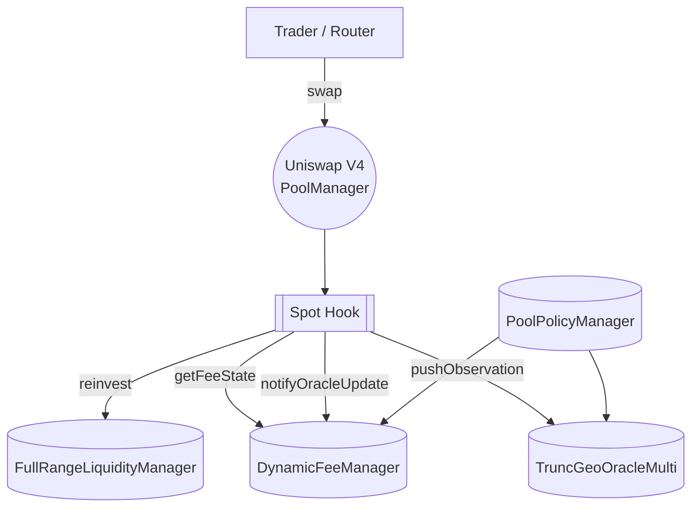
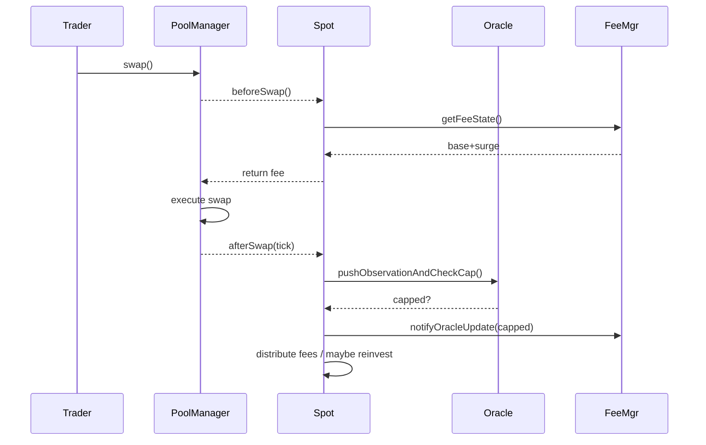

# AEGIS Dynamic Fee Mechanism (DFM)

A Statement of Intended Behavior

---

> **Scope**  
> This document consolidates and formalises the expected runtime behaviour of the AEGIS Dynamic Fee Mechanism—implemented as a Uniswap V4 *hook* (aka **Spot.sol**) together with its supporting contracts.  
> It supersedes earlier drafts and should be used by auditors, integrators, and protocol governors as **the single-source-of-truth** against which the Solidity implementation is reviewed.

## Table of Contents

1. [Executive Summary](#executive-summary)
2. [High-Level Architecture](#high-level-architecture)
3. [System Components](#system-components)
   1. [Spot Hook](#31-spot-hook)
   2. [DynamicFeeManager](#32-dynamicfeemanager)
   3. [TruncGeoOracleMulti](#33-truncgeooraclemulti)
   4. [PoolPolicyManager](#34-poolpolicymanager)
   5. [FullRangeLiquidityManager](#35-fullrangeliquiditymanager)
4. [Fee Model](#fee-model)
   1. [Base Fee](#41-base-fee)
   2. [Surge Fee](#42-surge-fee)
   3. [CAP Events](#43-cap-events)
5. [Swap Flow](#swap-flow)
6. [Parameter Catalogue](#parameter-catalogue)
7. [Safeguards & Invariants](#safeguards--invariants)
8. [Governance Hooks](#governance-hooks)
9. [Appendix](#appendix)

---

## Executive Summary

The **AEGIS Dynamic Fee Mechanism (DFM)** dynamically adjusts Uniswap V4 swap fees based on real-time volatility.  
Key properties:

* **Reactive Surge Fees.** Large, sudden price moves trigger an immediate _surge fee_, capitalizing on volatility.
* **Adaptive Baseline.** A slower feedback loop raises or lowers the _base fee_ to keep the frequency of extreme moves near a target.
* **POL Accretion.** A protocol-owned-liquidity vault recycles a share of fees back into the pool, widening depth over time.
* **Deterministic & On-chain.** All calculations depend solely on pool state and timestamps—no external price feeds.

This behaviour is realised by composing **five on-chain micro-contracts**—each described in its own one-pager (linked below).  The following sections explain how they inter-operate.

## High-Level Architecture



**Figure 1** – Run-time call graph (solid arrows = external calls).

## System Components

> 📚  *Each component has a dedicated one-pager—follow the links for storage layouts, ABIs, and gas tables.*

### 3.1 Spot Hook

*File*: [`docs/one_pagers/Spot.md`](one_pagers/Spot.md)

Acts as the **orchestrator**. It is installed as the pool's `hooks` address and therefore receives every Uniswap callback (`afterInitialize`, `beforeSwap`, `afterSwap`, …).

Responsibilities:

* Quote the **current fee** to the PoolManager before a swap.
* Log the executed tick in the oracle; relay the *capped* flag to the fee manager.
* Stream policy-defined fee shares to LPs, protocol, and the POL vault.
* Expose UX helpers (`deposit`, `withdraw`, `pokeReinvest`).

### 3.2 DynamicFeeManager

*File*: [`docs/one_pagers/DynamicFeeManager.md`](one_pagers/DynamicFeeManager.md)

Maintains per-pool fee state in a single packed slot:

* `baseFeePPM` – slowly varying component.
* `surgeFeePPM` – rapidly decaying component.
* `capStart`, `inCap`, and budget counters.

Provides:

```solidity
getFeeState(PoolId) → (uint256 base, uint256 surge);
notifyOracleUpdate(PoolId, bool capped);
```

### 3.3 TruncGeoOracleMulti

*File*: [`docs/one_pagers/TruncGeoOracleMulti.md`](one_pagers/TruncGeoOracleMulti.md)  
Adaptive oracle that:

* Stores a ring-buffer of `(tick, liquidity)` observations.
* Enforces a **max-ticks-per-block** (MTB) cap that self-tunes to hit `targetCapsPerDay`.
* Emits `MaxTicksPerBlockUpdated` on every step, feeding directly into the base-fee formula.

### 3.4 PoolPolicyManager

*File*: [`docs/one_pagers/PoolPolicyManager.md`](one_pagers/PoolPolicyManager.md)  
The **config registry**—read-only from the perspective of the hook stack. Governs:

* Fee splits *(POL / full-range incentive / LP share)*.
* Step-engine params (`baseFeeStepPpm`, `baseFeeUpdateIntervalSeconds`).
* Surge params and global safety bounds.
* Tick-scaling & tick-spacing whitelist.

### 3.5 FullRangeLiquidityManager

*File*: [`docs/one_pagers/FullRangeLiquidityManager.md`](one_pagers/FullRangeLiquidityManager.md)  
Vault that compounds protocol fees into a full-range Uniswap position. It only trusts calls from **Spot** or governance.

---

## Fee Model

### 4.1 Base Fee

```
baseFeePPM = maxTicksPerBlock × 28   // 28 ppm = 0.028 %
```

* `maxTicksPerBlock` comes from the oracle's auto-tune loop.  
* Bounds: `[minBaseFeePpm, maxBaseFeePpm]` (`100 ppm` – `30 000 ppm` by default).
* Adjustment cadence and step size are controlled by PolicyManager.

### 4.2 Surge Fee

```
surgeFeePPM₀ = baseFeePPM × surgeFeeMultiplierPpm / 1_000_000
```

* Multiplier default: **300 %** (capped at 300 %).
* Linear decay begins only _after_ a capped trade and lasts
  `surgeDecayPeriodSeconds` (default **6 h**).

### 4.3 CAP Events

A **CAP event** is triggered whenever the oracle truncates a tick delta.  
During an active CAP:

* `inCap == true`; `surgeFeePPM` fixed at `surgeFeePPM₀`.
* Each further capped trade resets the decay timer (_no stacking_).
* Event ends when an uncapped swap occurs _and_ `surgeFeePPM` has decayed to zero.

---

## Swap Flow



**Figure 2** – End-to-end path of a single swap.

---

## Parameter Catalogue

| Symbol | Default | Location | Description |
|--------|---------|----------|-------------|
| `tickScalingFactor` | `1` | PolicyManager | Links fee % → allowed tick move |
| `surgeFeeMultiplierPpm` | `3 000 000` | PolicyManager | Surge to `+300 %` of base |
| `surgeDecayPeriodSeconds` | `21 600 s` | PolicyManager | Surge linear decay window |
| `baseFeeStepPpm` | `20 000` | PolicyManager | Max ±2 % base-fee step |
| `baseFeeUpdateIntervalSeconds` | `86 400 s` | PolicyManager | Min 1 day between steps |
| `targetCapsPerDay` | `4` | PolicyManager | Auto-tune target frequency |
| `capBudgetDecayWindow` | `180 d` | PolicyManager | Leaky-bucket half-life |
| `minBaseFeePpm` | `10` | PolicyManager | 0.001 % floor |
| `maxBaseFeePpm` | `100 000` | PolicyManager | 10 % ceiling |

> **Tip:** per-pool overrides are always looked up first; `0` indicates "use global default".

---

## Safeguards & Invariants

* **Monotone Surge Decay** – `surgeFeePPM` can only decrease between CAP events.
* **Step-limit** – `baseFeePPM` can change at most `baseFeeStepPpm` per interval.
* **Hard Tick Cap** – Oracle clamps any tick delta > `maxTicksPerBlock`.
* **Hook Exclusivity** – Only the authorised Spot hook may call write-paths on Oracle & FeeMgr.
* **Gas Stipend** – External calls from Spot are limited to `100 k` gas; failure only disables surge for that swap.
* **Re-entrancy** – All mutators are `nonReentrant`; Spot additionally validates `msg.sender == PoolManager`.

---

## Governance Hooks

| Contract | Critical Setters | Purpose |
|----------|-----------------|---------|
| PolicyManager | `setFeeConfig`, `setSurgeFeeMultiplierPpm`, … | Tune risk params |
| FeeMgr | `setAuthorizedHook` | Rotate hook key |
| Oracle | `setAutoTunePaused`, `refreshPolicyCache` | Emergency freezes |
| Spot | `setPoolEmergencyState`, `setReinvestmentPaused` | Halt swaps / POL ops |

All governance functions are `onlyOwner` and expected to be behind a multi-sig + timelock.

---

## Appendix

* **Linting** – The file follows [Markdown-lint](https://github.com/markdownlint/markdownlint) style-guide: 
  * Hard-wrapped at 100 chars.  
  * ATX-style headings.  
  * Code fences use language hints.
* **Changelog**  
  * **v1.0** – Initial release (2025-06-04).
* **References**  
  * [Uniswap V4 Hook Interface](https://github.com/Uniswap/v4-core).  
  * AEGIS One-Pagers: [Spot](one_pagers/Spot.md), [DynamicFeeManager](one_pagers/DynamicFeeManager.md), [TruncGeoOracleMulti](one_pagers/TruncGeoOracleMulti.md), [PoolPolicyManager](one_pagers/PoolPolicyManager.md), [FullRangeLiquidityManager](one_pagers/FullRangeLiquidityManager.md)