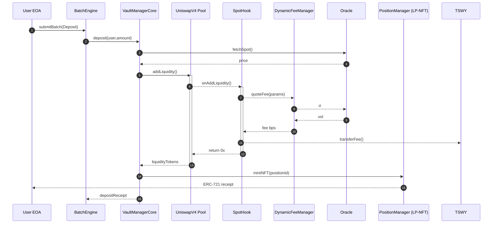

# 3 System Architecture

## 3.1 Module Overview

| Module                       | Core Responsibilities                                                                                 | Upstream Inputs                              | Downstream Effects                                                                                  |
| ---------------------------- | ----------------------------------------------------------------------------------------------------- | -------------------------------------------- | --------------------------------------------------------------------------------------------------- |
| **VaultManagerCore**         | Maintains user vaults, enforces margin, settles PnL, triggers liquidations, sends surplus to Treasury | Calls from BatchEngine; Oracle spot prices   | Emits vault events, mints/ burns debt, interacts with PositionManager, Treasury & LiquidationEngine |
| **BatchEngine Router**       | Stateless dispatcher that validates action batches and invokes VaultManagerCore                       | EOA / dApp transactions                      | —                                                                                                   |
| **AEGIS SpotHook** (`IHook`) | Calculates dynamic fee on every Uniswap V4 pool callback and forwards net fees to Treasury            | Pool kernel callback, fee curve params       | Calls DynamicFeeManager; transfers fees to Treasury                                                 |
| **DynamicFeeManager**        | Computes time‑varying swap, mint & burn fees (may rebate pool)                                        | Oracle volatility (`σ`)                      | Returns fee to SpotHook; optional rebate transfer to pool                                           |
| **TruncGeoOracleMulti**      | Supplies TWAP spot price and volatility                                                               | External adapters / keepers                  | Read‑only by DynamicFeeManager & VaultManagerCore                                                   |
| **PositionManager** (`POSITION_MANAGER_ROLE`) | ERC‑721 wrapper for LP positions; collateral management                                               | Mint/burn instructions from VaultManagerCore | Issues or burns LP‑NFTs                                                                             |
| **LiquidationEngine**        | Trust‑less collateral seizure & auction                                                               | VaultManagerCore callbacks, keeper tx        | Transfers collateral; records penalties; sends funds to Treasury                                    |
| **PolicyManager**            | Registry for risk parameters, interest curves, caps                                                   | Governor proposals                           | Read‑only by Core & FeeManager                                                                      |
| **Treasury**                 | Receives protocol fees & POL; handles vesting                                                         | Fee transfers from SpotHook & Core           | Admin withdrawals                                                                                   |
| **Governor + Timelock**      | Two‑step governance over upgrades & parameters                                                        | Token‑holder votes                           | Updates PolicyManager & upgradeable contracts                                                       |
| Module | Upgrade Proxy |
| --- | --- |
| VaultManagerCore | VaultManagerProxy |
| BatchEngine Router | — |
| SpotHook | per-pool immutable |
| DynamicFeeManager | FeeManagerProxy |
| TruncGeoOracleMulti | OracleProxy |
| PositionManager | PositionManagerProxy |
| LiquidationEngine | LiquidationProxy |
| PolicyManager | PolicyManagerProxy |
| Treasury | TreasuryProxy |
| Governor + Timelock | governance-controlled |

> *Design axiom:* **All state‑mutating user operations traverse `BatchEngine → VaultManagerCore`.**
> Pool/Hook interactions are *fee‑only* and never alter vault state.

Borrowing is handled inside the same core module: collateral and debt are tracked in invariant‑priced shares so lending operations use the same units as liquidity. [See “Share-Based Borrowing & Invariant Accounting”](#share-borrow-intro).

---

### 3.2 High‑Level Flowchart

```mermaid
flowchart LR
    subgraph User
        EOA[(EOA / dApp)]
    end
    subgraph Entry
        BE[BatchEngine<br>Router]
    end
    subgraph Core
        VMC[VaultManagerCore]
    end
    subgraph Pool
        UV4[Uniswap V4 Pool]
        SH[AEGIS SpotHook]
    end
    subgraph Services
        DFM[DynamicFeeManager]
        ORA[Oracle]
    end
    subgraph Collateral
        PM[PositionManager<br/>LP-NFT]
    end
    subgraph Risk
        LQ[LiquidationEngine]
    end
    subgraph Gov
        GOV[Governor<br>+ Timelock]
        POL[PolicyManager]
    end
    subgraph Treasury
        TSWY[Treasury]
    end
    subgraph Libraries
        LIB[Math Libraries]
    end

    EOA --> BE --> VMC
    VMC -->|addLiquidity| UV4
    UV4 --> SH
    SH --> DFM
    DFM -.re‑bate.-> UV4
    SH --> TSWY
    VMC --> ORA
    DFM --> ORA
    VMC --> PM
    LQ --> VMC
    GOV --> POL --> VMC
    GOV --> VMC
    VMC --> TSWY
    VMC -->|delegate-call (T9)| LIB
```

*Solid arrows = direct calls / transfers*
*Dashed arrow = optional rebate path*
*Delegate-call arrow = uses Math Libraries (T9)*

---

### 3.3 Deposit Sequence (Batch‑Driven)



---

### 3.4 Roles & Authorisation Matrix

| Role / Actor                                  | Privileges                                          | Granted By |
| --------------------------------------------- | --------------------------------------------------- | ---------- |
| **ProtocolGovernor (DAO)**                    | `DEFAULT_ADMIN_ROLE`; upgrades; parameter changes   | Deployer   |
| **Timelock**                                  | Enforces 48 h delay on governor's sensitive actions | Governor   |
| **VaultAdmin** (`VAULT_CONF_ROLE`)            | Adjust interest curves; toggle liquidation          | Governor   |
| **KeeperBot** (`LIQUIDATOR_ROLE`)             | Call `executeLiquidation()` on LiquidationEngine    | VaultAdmin |
| **SpotHook** (`POOL_HOOK_ROLE`)               | Approved callback target inside Core                | Governor   |
| **PositionManager** (`POSITION_MANAGER_ROLE`) | Mint/Burn LP‑NFT collateral                         | Governor   |
| **Treasury** (`FEE_COLLECTOR_ROLE`)           | Receive fee & surplus transfers                     | Governor   |
