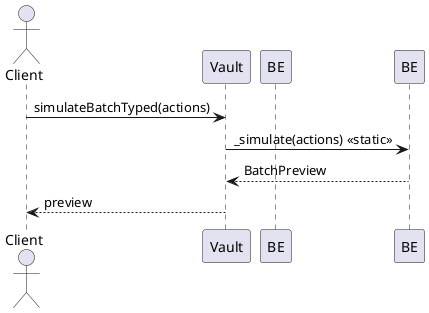

> v1.2.1-rc3 – T4 T8 T9 Alignment

# 5.7 Batch Processing Engine (Atomic Vault Action Batching)

| Tenet ID | Processing Guideline                                         | Origin |
| -------- | ------------------------------------------------------------ | ------ |
| T1       | Clarity of Intent                                            | A      |
| T2       | Atomic Safety                                                | A      |
| T3       | Lean Paths for Passive Flows                                 | B      |
| T4       | Gas-Amortisation (cache shared state once per batch)         | C      |
| T5       | Deterministic Ordering                                       | B      |
| T6       | Invariant Parity                                             | A      |
| T7       | Typed Batching                                               | B      |
| T8       | Minimal Exposure (black-list risky selectors in batches)     | C      |
| T9       | Upgradeable Modularity (delegate-call helper math libraries) | C      |
| T10      | Event Transparency                                           | B      |

**Overview:** AEGIS V2 introduces a **Batch Processing Engine** that allows multiple vault operations to be executed atomically in a single transaction via a new function `executeBatch`. This section defines the batch execution pipeline from initialization through finalization, the full set of batch action codes (V0–V14) with their semantics, and all related rules (ordering, safety checks, gas and reentrancy, etc.) for implementation. The batch engine is integrated into `VaultManagerCore` and uses the same internal logic as individual actions, preserving all invariants and pause/guard conditions. By enforcing a deterministic ordering (risk-reducing actions first, etc.) and comprehensive checks, it guarantees that no intermediate state of a batch violates solvency or risk constraints.

### Public Interface – `executeBatchTyped`

```solidity
function executeBatchTyped(Action[] calldata actions) external nonReentrant;
struct Action {
    uint8 code;
    bytes data;
}
Using `Action` structs saves roughly 17% calldata compared to the bytes array.[^gas-saving]

```

**Description:** Executes an array of encoded vault actions atomically as a single batch. Each element in the `actions` array is a packed byte sequence representing one sub-action. The first byte of each sequence is an **Action Code** (V0–V14) identifying the action type, followed by the parameters for that action encoded in binary. For example, a Deposit action (code V0) might be encoded as `[0x00 | parameters...]`. The function will decode and perform each action in a safe, predefined sequence (detailed below), applying all state changes only if **every action succeeds**. If any sub-action reverts or any invariant check fails, **the entire batch reverts** with no state change (all intermediate updates rolled back).

**Execution Rules & Safety:** `executeBatch` may be called by any EOA or contract. It is protected by the vault's global `nonReentrant` lock (preventing any reentrancy during batch execution). On entry, the engine performs necessary upfront updates (like accruing interest and updating oracle prices) and then processes the actions. Crucially, the engine enforces **all the same safety checks** as individual operations, plus additional batch-level guards:

- _Atomicity:_ All-or-nothing execution. If one action fails, all prior actions in the batch are reverted. There is no partial completion.
- _Deterministic order:_ Actions are not executed strictly in the user-provided order if that order is unsafe. Instead, the engine reorders them into a fixed **pipeline of stages** (Phase A then Phase B, see below) to ensure no intermediate step can endanger vault solvency. The user-provided order is preserved **within** each risk category, but risk-reducing moves always occur before any risk-increasing ones.
- _Invariant checks:_ After **each** sub-action, and again at batch conclusion, the vault's critical invariants are checked. These include collateralization (Loan-to-Value must remain below liquidation threshold, e.g. < 98%), pool utilization limits (≤ 95%), oracle price validity, etc. If any check fails at any point, the batch reverts immediately.
- _Gas and recursion:_ Batching is designed for efficiency. Typical batches of 6–12 actions stay well within block gas limits. The implementation avoids unbounded loops (at most two passes over the action list) and caches common operations (like interest accrual) to save gas. No external calls except those inherent to each action (e.g., Uniswap pool calls) are introduced. Recursion is prevented by the reentrancy guard and by not allowing `executeBatch` to be called from within itself.
- _Reentrancy and external calls:_ The `nonReentrant` modifier locks the vault for the duration, so no other vault function (including another batch) can interrupt. External protocol calls that occur (e.g., Uniswap pool modifications, oracle queries) are either view-only or known-safe hooks that complete before returning control. Thus, no intermediate external interaction can reenter the vault in the middle of a batch.

**Return value:** The `executeBatch` function itself can return nothing (or a boolean success). All outputs from sub-actions (e.g., tokens transferred out) are observed via events or the actions' effects. An optional aggregate event `BatchExecuted(address user, uint256 actionsCount)` may be emitted on success to log the batch execution, but it's not strictly required since each sub-action emits its own event.

### View‑mode `_simulate` wrapper

`simulateBatchTyped` invokes the same engine via `staticcall` so callers can preview a batch without mutating state. The vault builds an in‑memory snapshot and calls `BatchEngine._simulate`, executing all ordering and invariant checks. Results are summarized in a `BatchPreview` struct.



### Batch Execution Pipeline (init → finalize)

When `executeBatch` is invoked, the VaultManagerCore processes the batch through a series of **stages** from **initBatch** to **finalizeBatch**. The diagram below illustrates the control flow:

&#x20;_Batch execution control flow: the engine first performs global updates, then executes all Phase A (risk-reducing) actions, followed by all Phase B (risk-increasing or neutral) actions, with invariant checks throughout. If any step fails, the batch is reverted. (This diagram is also provided in Appendix A.)_

The pipeline can be described in sequential stages:

1. **Init Batch – Global Pre-Processing:** On batch start, perform one-time global updates to ensure a consistent baseline:

   - **Interest Accrual:** For each liquidity pool that will be affected by the batch (e.g. any pool where the user has debt or will borrow/repay), call `accrueInterest` once upfront. This brings interest indexes up to date so that any borrow/repay actions use the latest rates. Each pool's interest is accrued at most once per batch (no multiple accruals even if several actions use the same pool). An `InterestAccrued` event may be emitted per pool (as in single actions) when this happens (see **Share-Based Borrowing & Invariant Accounting** in Section 5.3 of the specification). [See "Share-Based Borrowing & Invariant Accounting"](#share-borrow-intro)
   - **Oracle Price Update:** Ensure fresh price data for all relevant assets. The vault will update or fetch the latest oracle prices (from the **Spot** Uniswap TWAP oracle or Chainlink feeds) for any pool whose collateral or debt will be evaluated. If the protocol's design pushes oracle updates via the Uniswap hook on swaps, the engine may invoke a read to confirm the current price. This guarantees that collateral valuations and health checks use up-to-date prices.
   - **Policy Checks Cache:** Load any policy parameters needed for the batch. For example, fetch the collateral factor and utilization cap for each pool from the **PoolPolicyManager** once at the start. These will be used for checks during execution. (Policy data is generally static per block, so caching is safe.)
   - **Initial State Snapshot:** (Optional) The engine may record the vault's starting state (e.g. initial LTV or debt) for use in relative safety comparisons. This helps enforce that intermediate steps do not exceed the initial risk level except as allowed (with final state still under limits).

### Selector Guard (T8)

Before executing Phase A, the engine checks each action selector against a blacklist. If a selector is tagged `@noBatch`, the entire batch reverts.

| Selector                    | Reason                         | Tenet |
| --------------------------- | ------------------------------ | ----- |
| `0x3dcb45e5` (liquidate)    | High-risk; needs serial checks | T8    |
| `0xd615cc62` (coverBadDebt) | Governance-only operation      | T8    |
| `0x849bf635` (flashLoan)    | Potentially unsafe in batch    | T8    |

The blacklist is generated from the repository's `selectors.json`. Run
`forge inspect src/VaultManagerCore.sol --selector-digest > selectors.json`
whenever the interface changes; CI enforces the file is up to date.

2. **Phase A – Risk-Reducing Actions:** The engine next processes all **risk-reducing or neutral** actions first. These are actions that either decrease the user's debt, add collateral, or otherwise make the vault safer. They include:

   - **Deposits** (adding collateral, whether tokens or liquidity shares),
   - **Repays** (paying back debt),
   - **Fee Claims** that **increase** collateral (e.g. reinvesting fees, if any action did so),
   - Certain maintenance ops like updating position info, etc., which do not reduce collateral.
   - Any other action explicitly categorized as risk-reducing or benign (for example, claiming earned fees from a position **could** reduce collateral value if those fees are removed; we handle that later under risk-increasing if applicable).

   The engine will iterate through the provided `actions` list and **extract all Phase A actions** (in the order they appear). It executes each of these immediately, in sequence. After each sub-action:

   - The vault's state is updated accordingly (collateral and debt balances, etc.), and an event for that action is emitted (e.g., `Deposit`, `Repay`).
   - An **intermediate invariant check** runs: if the action resulted in any violation (which is unlikely for these actions since they only help safety), the batch reverts on the spot. In practice, deposits and repays should _never_ break solvency or utilization rules – they move LTV in the right direction – so failures here would only arise from external issues (like token transfer failure or a paused pool). Those emit their own errors (e.g. `ContractPaused`, `TransferFailed`).
   - The vault ensures that after each Phase A action, the user's vault health is **no worse than before**. Typically LTV will improve or stay the same. (If somehow an invariant did worsen, it triggers revert; this should not happen under normal conditions for Phase A actions.)

   Phase A thus brings the vault to its safest intermediate state, maximizing collateral and minimizing debt before any potentially risky actions.

3. **Phase B – Risk-Increasing Actions:** Once all safe actions are done, the engine executes the **risk-increasing** actions. These are actions that remove collateral or increase debt or otherwise raise the vault's risk. They are deferred to after Phase A to ensure the vault has as much buffer as possible. Phase B actions include:

   - **Withdrawals** (removing collateral assets),
   - **Borrows** (taking on new debt),
   - **Swaps** that potentially reduce the value of one side of collateral (e.g. swapping a more stable asset for a volatile one could be considered risk-increasing; generally, swaps are treated as neutral in net value, but we place them in Phase B to be safe, after deposits),
   - **Opening new LP positions or limit orders**, which _reallocate_ collateral (not increasing debt, but these actions can temporarily reduce available collateral for covering debt – e.g., moving assets into an illiquid position or an out-of-range order is treated as a risk-increase for ordering purposes),
   - **Cancelling limit orders or closing positions** when those return collateral to the user (essentially withdrawals of previously locked collateral),
   - **Liquidations** (if the batch caller is liquidating another user's vault via V9/V12 actions – these don't affect the caller's vault risk but affect a victim's vault; the engine treats them as permissible in Phase B since they don't depend on caller's collateral state).

   The engine either already queued these actions from the first pass or simply knows to execute them now after skipping them in Phase A. It now runs through all Phase B actions in their original order relative to each other. For each sub-action:

   - Decode and execute the action's handler. All the usual per-action validations run (e.g., a Withdraw will check that the remaining collateral after withdrawal satisfies collateral ratio constraints; a Borrow will check the borrow limit, etc.). If any such check fails, that action (and thus the batch) reverts with the appropriate error (e.g. `Undercollateralized`, `ExcessiveBorrow`, `UtilizationTooHigh`, etc.).
   - Immediately after execution, perform an invariant check on the updated state: ensure the user's vault is still solvent (if not, revert), utilization is within limits, and no other global invariant is violated. These checks are often embedded in the action's own logic. For example, the internal `_borrow` function will revert if the resulting utilization > 95% or if collateral is insufficient. Similarly, `_withdraw` will revert if the withdrawal would make the vault insolvent.
   - Also compare to the batch's start state if needed: generally, we require that _at no point_ does the vault's LTV exceed 98% or go beyond what it started with (except when starting from zero debt). In practice, by doing all deposits/repays first, any subsequent withdraw/borrow should still leave LTV <= initial LTV (or at least under the liquidation threshold). The engine's design (Phase A then B) ensures this property, but the code includes safeguards. For example, if a user tried to withdraw collateral first and repay later, the engine would have reordered it. If it couldn't (say the user only withdrew without repaying), then the withdraw action itself would hit the invariant check and revert if it breaches limits.
   - Emit events for each action (e.g. `Withdraw`, `Borrow`, `Swap`, etc.) to record the outcome.

   By the end of Phase B, all user-requested actions have been executed in a safe sequence. Any action that was unsafe either was reordered or has already caused a revert preventing batch completion.

4. **Interwoven Oracle & Fee Updates:** Throughout Phases A and B, some actions trigger asynchronous updates:

   - **Swap actions:** Each Swap (V8) is executed in-line during Phase B in the user-specified order. A swap will invoke the Uniswap pool's hooks (`beforeSwap/afterSwap` via the Spot contract) which updates the oracle price and applies dynamic fees. This means after each Swap, the oracle price used for subsequent actions is refreshed to reflect that trade's impact. The deterministic pipeline guarantees that any later action (e.g. a Borrow following a Swap) sees the **post-swap** price, ensuring consistency in collateral valuation.
   - **Fee accruals:** Actions like swaps and liquidity adjustments accrue trading fees to the vault. These fees remain in the vault's accounting as "pending fees". They are not reinvested or distributed mid-batch (unless a specific action for it is included) – they will either be reinvested by a separate `reinvestFees` call (which could itself be a batch action) or left for later. The key point is that fee accrual during a batch doesn't destabilize anything; it slightly increases the vault's collateral (fees earned) which only helps solvency. The batch engine doesn't need special handling for fees aside from updating internal counters via the hook callbacks.
   - **Interest index cached once per batch (T4):** If multiple borrow or repay actions on the same pool occur, interest is accrued at the start so later calculations reuse that index. This avoids double-accrual and saves gas.

5. **Verify Invariants:** After all state updates are written, the engine calls `InvariantSuite.verify()` to enforce every post-condition listed in the workflow tables. This corresponds to **Step 13** in the detailed pipeline diagram.

6. **Finalize Batch – Comprehensive Check and Commit:** After executing all actions in the proper order, the engine performs a final verification and then concludes the batch:

   - **Final Invariant Enforcement:** The user's vault (and any other affected vault, such as a liquidated party's) is checked one last time for all safety requirements. This is a "failsafe" to catch any scenario not caught by prior checks. It verifies that **Loan-to-Value < 98%** (or whatever the liquidation threshold is) for every affected vault, meaning the vault is solvent and not in the danger zone. It also checks that pool utilization for each involved pool is ≤ 95% (ensuring the batch didn't over-utilize liquidity). If any of these conditions are violated at this point, the entire batch is reverted (rolled back) – however, due to the ordering and per-action checks, such a situation _should not occur_ unless there was an unforeseen error. Essentially, the final check is an assert that the system invariants hold.
   - **Unlock Reentrancy:** The `nonReentrant` lock is released as the function is about to return (this happens automatically when the external call finishes, but conceptually this is part of finalization).
   - **Event Emission:** A `BatchExecuted` event may be emitted indicating success. In addition, as noted, all relevant per-action events will have been emitted during execution. The final event could simply log the batch summary (e.g. user address and number of actions). This event is mainly for analytic or debugging convenience; listeners can also infer a batch by seeing multiple action events with the same transaction ID. (If the implementation chooses, it can omit a BatchExecuted event to save gas, relying on sub-events alone.)
   - **Return:** If all goes well, `executeBatch` returns (success). If any issue arose, an error is thrown and the function never reaches a normal return. In all cases of failure, **state changes are reverted in entirety** – the contract behaves as if `executeBatch` was never called, except for emitting a revert error.

**Deterministic Ordering & Phase Categories:** The separation into Phase A and B is the core of deterministic ordering. All **risk-reducing** actions are guaranteed to execute before any **risk-increasing** ones, regardless of the order in which the user provided them. If the user's input sequence is already safe (e.g. deposit then borrow), the execution order will be the same. If the input sequence is unsafe (e.g. withdraw then repay), the engine will internally reorder those (repay first, then withdraw). In cases where reordering is not straightforward or the user's plan is inherently unsafe (e.g. withdraw that would make them insolvent even if done last), the engine will simply revert that action. This deterministic pipeline ensures that users cannot gain an advantage or slip past checks by ordering actions creatively – the outcome will be the same safe end state or no state change at all.

### Step Ordering

| Phase       | Actions              |
| ----------- | -------------------- |
| **Phase A** | addCollateral, repay |
| —           | swap                 |
| **Phase B** | borrow, withdraw     |

The engine reorders or reverts if a user-supplied sequence violates this order.

**Neutral Actions:** Some actions neither clearly increase nor reduce risk (for example, pure swaps or internal bookkeeping updates). The engine typically schedules these in Phase B by default, on the assumption that any preparatory moves (like obtaining collateral via deposit) should happen first. A swap doesn't change the total value of collateral, so from a solvency perspective it's neutral; however, placing it in Phase B ensures any new collateral from deposits is already in place before the swap executes (in case the swap needed that collateral as input). There's flexibility in categorizing truly neutral actions – the main requirement is that no Phase B action should depend on something that a Phase A action would have provided. The chosen ordering satisfies that.

**Accrual & Oracle Sanity (Per-Batch):** By doing one interest accrual and oracle update at the start of the batch, we ensure the batch operates on a consistent view of the system. The oracle "sanity" is inherently maintained by using fresh prices; if an oracle update fails or returns an out-of-range value, actions that depend on it (like a collateral check) might revert with an oracle error or price sanity failure (if such guard is in place). The system expects oracle updates to reflect realistic prices; sudden drastic price moves within the single transaction are generally mitigated by Uniswap's time-weighted pricing and the fact that arbitrage trades would need to occur (which cannot happen inside our locked execution). Thus, one price update per batch is sufficient for safe operation. At final check, if somehow prices or interest moved in an unexpected way mid-batch (which they shouldn't, since all moves happen within the transaction under our control), the invariants catch any resulting issue.

**Gas Considerations:** A batch is effectively executing a series of contract calls in one go, so the total gas is the sum of all sub-actions plus overhead. The engine's overhead for batching (looping, decoding, ordering) is minimal (on the order of a few tens of thousands of gas) compared to the actions themselves. For example, a batch containing a Deposit (\~175k gas), then Borrow (\~115k), then a Swap (\~40k) would total around 330k gas. Even larger sequences (10–12 actions mixing deposits, swaps, LP operations) are expected to stay in the low millions of gas, which is within block limits on Ethereum L1. The deterministic ordering adds at most one extra loop in the implementation (to separate phases). Developers should be mindful of stack depth (too many actions could pose a stack risk if not handled carefully), but typical usage keeps this manageable. There is no unbounded recursion or unbounded loop over external data, so the batch size is practically limited by gas and not by algorithmic complexity. Additionally, since the vault's design accrues interest once and caches policy/lookups, a batch of N actions is cheaper than N separate transactions in many cases, due to shared setup cost.

### Batch Action Codes V0–V14

The batch engine supports **15 distinct action codes** labeled **V0 through V14**. Each code corresponds to a specific vault operation or meta-operation. Table 5.7.a below lists all action codes, their names, their general risk category (Phase A or B), and the internal handler function (canonical implementation signature) associated with each:

| Code    | Action Name                                                    | Phase (Risk Effect)                                              | Internal Handler Signature (simplified)                                                                                                                        |
| ------- | -------------------------------------------------------------- | ---------------------------------------------------------------- | -------------------------------------------------------------------------------------------------------------------------------------------------------------- |
| **V0**  | **Deposit Full-Range Liquidity**                               | Phase A (Risk-Reducing)                                          | `function _depositFullRange(bytes32 poolId, uint256 amount0, uint256 amount1, uint256 minShares) internal`                                                     |
| **V1**  | **Withdraw Full-Range Liquidity**                              | Phase B (Risk-Increasing)                                        | `function _withdrawFullRange(bytes32 poolId, uint256 shares, uint256 amount0Min, uint256 amount1Min, address to) internal`                                     |
| **V2**  | **Borrow Assets (Increase Debt)**                              | Phase B (Risk-Increasing)                                        | `function _borrow(bytes32 poolId, uint256 shareAmount, address to) internal`                                                                                   |
| **V3**  | **Repay Debt**                                                 | Phase A (Risk-Reducing)                                          | `function _repay(bytes32 poolId, uint256 shareAmount, address from) internal`                                                                                  |
| **V4**  | **Open Custom LP Position** (Conc. Liquidity)                  | Phase B (Neutral-to-Slight Risk)                                 | `function _openPosition(bytes32 poolId, int24 tickLower, int24 tickUpper, uint128 liquidity, uint256 amount0Max, uint256 amount1Max) internal`                 |
| **V5**  | **Close Custom LP Position**                                   | Phase B (Risk-Increasing if collateral withdrawn)                | `function _closePosition(uint256 positionId, uint256 amount0Min, uint256 amount1Min) internal`                                                                 |
| **V6**  | **Place Limit Order** (One-sided LP)                           | Phase B (Neutral-to-Slight Risk)                                 | `function _placeLimitOrder(bytes32 poolId, bool isBuyOrder, uint256 amountIn, int24 tickTarget) internal`                                                      |
| **V7**  | **Cancel Limit Order**                                         | Phase B (Risk-Increasing if releasing collateral)                | `function _cancelLimitOrder(uint256 orderId, address to) internal`                                                                                             |
| **V8**  | **Swap (Market Swap via Vault)**                               | Phase B (Neutral)                                                | `function _swap(bytes32 poolId, bool zeroForOne, uint256 amountIn, uint256 amountOutMin, address to) internal`                                                 |
| **V9**  | **Liquidate Vault (Partial)**                                  | Phase B (Risk-Reducing for system)                               | `function _liquidate(bytes32 poolId, address victim, uint256 repayAmount, address to) internal returns (uint256 seizedCollateral0, uint256 seizedCollateral1)` |
| **V10** | **Claim Position Fees** (Collect fees from an active position) | Phase A (Risk-Reducing or Neutral)                               | `function _claimPositionFees(uint256 positionId, address to) internal` _(exact signature may vary)_                                                            |
| **V11** | **Close Vault (Repay and Withdraw All)**                       | Phase B (Risk-Reducing overall, but final collateral withdrawal) | `function _closeVault(bytes32 poolId, address to) internal` _(composite operation: repay all and withdraw)_                                                    |
| **V12** | **Liquidate Vault (Full)**                                     | Phase B (Risk-Reducing for system)                               | _Uses `_liquidate` with full repayment; can reuse V9 handler logic or separate_                                                                                |
| **V13** | **Poke Positions** (Update accrual)                            | Phase A (Neutral maintenance)                                    | `function _pokePositions(address user, bytes32[] memory poolIds) internal` _(example: refresh interest/fee accrual on multiple positions)_                     |
| **V14** | **(Reserved for Future Use)**                                  | N/A                                                              | _(No action – placeholder for future expansion)_                                                                                                               |

**Table 5.7.a: Batch Action Codes (V0–V14).** _Phase indicates the default execution phase: "Phase A" actions either reduce risk or have no negative effect on solvency (executed early), while "Phase B" actions can increase risk or remove collateral (executed after Phase A). "Neutral" indicates no net collateral change; these are typically treated as Phase B by default. Internal handler signatures show the function prototypes that implement each action's logic in `VaultManagerCore`._

Below, each action code is defined in detail, including its purpose, parameters, effects on vault state, emitted events, and error conditions. (Note: The naming and signatures are aligned with the current `IVaultManagerCore` interface and `VaultManagerCore.sol` implementation. Some events use slightly different field representations for consistency with the code.)

#### V0: Deposit Full-Range Liquidity

**Description:** Deposits assets into the vault's Uniswap **full-range liquidity position**. In effect, the user supplies token0 and/or token1, and the vault adds them to its managed Uniswap V4 pool position covering the entire range, minting new **vault shares** to the user in return. This increases the user's collateral in the vault (and overall pool liquidity). _Risk effect:_ This is a collateral-increasing action (Phase A) – it **improves** the user's collateralization.

**Handler:** `_depositFullRange(bytes32 poolId, uint256 amount0, uint256 amount1, uint256 minShares) internal`. The parameters are:

- `poolId`: Identifier of the Uniswap V4 pool (encodes token pair and fee tier) where to deposit liquidity.
- `amount0` and `amount1`: The amounts of token0 and token1 the user contributes. At least one of these must be non-zero (the user can deposit single-sided or both).
- `minShares`: The minimum acceptable number of vault LP shares to mint for this deposit. This is a slippage protection – if the vault would mint fewer shares than this (meaning the price moved unfavorably such that the deposit is less effective), the deposit reverts with `SlippageFailure`.

**Execution flow:**

1. **Pre-conditions:**

   - Deposits must be allowed: the global contract pause must not be active for deposits, and the specific `poolId` should not be in an emergency state that halts liquidity additions. If violated, throw `ContractPaused` or `PoolInEmergencyState`.
   - The provided amounts must be valid. At least one of `amount0` or `amount1` > 0 (cannot deposit zero of both). The user must have approved the VaultManager to transfer these tokens from their wallet, and have sufficient balance. If not, the ERC20 transfer will fail (handled later).
   - If the action encoding included a `deadline` (timestamp) for the deposit, ensure the current time is <= deadline (else revert `DeadlinePassed`).

2. **Execution:**

   - The vault transfers `amount0` of token0 and `amount1` of token1 from the user's address into the vault (using `safeTransferFrom`). Now the vault holds those tokens temporarily.
   - The vault calls Uniswap's `PoolManager.modifyPosition` for its full-range position, adding liquidity using the received tokens. This operation goes through the Uniswap hook (Spot) as usual: Uniswap will call `Spot.beforeModifyPosition`, then pull the tokens from the vault to add liquidity, then `Spot.afterModifyPosition`. On success, the vault's position NFT now represents more liquidity. Uniswap returns how much liquidity was added.
   - The VaultManager calculates how many **vault shares** to mint to the user for this deposit. Vault shares (ERC-6909 tokens) represent the user's proportional ownership of the vault's pool position. The share amount is determined by the deposit's value relative to the vault's total liquidity (following the formula established in Phase 2 for share minting).
   - Slippage check: verify `sharesMinted >= minShares`. If the vault would mint fewer shares than the user expected (perhaps due to price movement while adding liquidity such that not all tokens could be used), the function reverts with `SlippageFailure` (ensuring the user's minimum output requirement is met).
   - Update user's vault state: increase the user's `shareBalance[poolId]` by the new shares minted (adding to their collateral). Increment the global totals for deposits of token0 and token1 (the vault's record of total liquidity).
   - Mint the ERC-6909 vault share tokens to the user's address equal to `sharesMinted`. (If this is the user's first deposit, their vault entry is created in storage.)

3. **Post-conditions:**

   - The user's vault collateral for that pool has increased. Their vault's LTV either improves (if they had debt) or stays at 0% if no debt. Adding collateral cannot harm solvency – it can only help or have no effect if no debt.
   - The vault's total liquidity for the pool increases; more assets are now in the pool earning fees.
   - The action does not by itself trigger any invariant violation. No special collateral ratio check is needed _after_ because adding collateral is inherently safe. (The code may still double-check that if the user had debt, their new LTV is still below maintenance – it will be, or the deposit wouldn't be necessary.)

4. **Events:** Emits a `Deposit` event. We use the standard event format (from Phase 2) augmented with pool information:

   ```solidity
   event Deposit(bytes32 indexed poolId, address indexed user, uint256 shares, uint256 amount0, uint256 amount1);
   ```

   This logs the pool, the user, how many vault shares were minted, and the amounts of token0 and token1 deposited. Listeners use this to track deposits and share issuance.

5. **Errors:**

   - `ContractPaused` if deposits are globally paused.
   - `PoolInEmergencyState` if the target pool's liquidity ops are halted.
   - `InsufficientBalance` / `TransferFailed` if the user's token transfer to the vault fails (insufficient balance or allowance).
   - `SlippageFailure` if the minted shares are below `minShares`.
   - `DeadlinePassed` if the provided deadline has already expired.
   - (Implicitly, `InvalidInput` if both amount0 and amount1 were 0.)

#### V1: Withdraw Full-Range Liquidity

**Description:** Withdraws liquidity from the vault's full-range position, effectively redeeming a specified number of the user's vault shares for the underlying tokens. The vault burns the given shares and returns the proportional amounts of token0 and token1 to the user. This removes collateral from the vault (reducing the user's position). _Risk effect:_ This is collateral-decreasing and potentially increases the user's risk (Phase B).

**Handler:** `_withdrawFullRange(bytes32 poolId, uint256 shares, uint256 amount0Min, uint256 amount1Min, address to) internal`. Parameters:

- `poolId`: The pool from which to withdraw.
- `shares`: Number of vault shares to redeem (burn).
- `amount0Min`, `amount1Min`: Minimum acceptable amounts of token0 and token1 to receive for the shares (slippage protection).
- `to`: The recipient address for the withdrawn tokens (could be the user or another address they designate).

**Execution flow:**

1. **Pre-conditions:**

   - Withdrawals must be allowed (no global pause on withdrawals; pool not in emergency state for removing liquidity).
   - The user must have at least the `shares` amount in their vault balance for the specified pool. If not, revert (e.g. `InsufficientBalance` or a similar error).
   - If a `deadline` was encoded in the action data, ensure current time <= deadline (else `DeadlinePassed`).
   - Check that `to` is a valid address (not zero).
   - IMPORTANT: If the user has an outstanding debt, withdrawing collateral could jeopardize solvency. The engine (or this function) will ensure that after withdrawing these shares, the user's remaining collateral still meets the maintenance collateral factor for their debt. In practice, before executing, we compute what the user's post-withdrawal collateral ratio would be. If this withdrawal would push LTV ≥ 98% (or otherwise violate policy), the function must revert with `WithdrawalWouldMakeVaultInsolvent` (or a similar `Undercollateralized` error). This check uses the latest oracle prices (from batch start or updated after swaps) and current debt. It effectively prevents users from withdrawing too much collateral if they have debt.

2. **Execution:**

   - Calculate the fraction of the vault's full-range liquidity represented by `shares`. For example, if the user is withdrawing X% of the total vault shares in that pool, the vault will remove X% of its liquidity.
   - The vault calls Uniswap `PoolManager.modifyPosition` to _remove_ the appropriate amount of liquidity from its full-range position NFT. This will burn the specified liquidity and return the underlying token amounts to the vault. The Spot hook will be invoked around this call (performing any fee calculations and ensuring the pool is not in an emergency state for removal).
   - Uniswap returns two amounts: `amount0_out` and `amount1_out` – the amounts of token0 and token1 that correspond to the burned liquidity (including any fees earned by that liquidity position up to now).
   - The vault decreases the user's `shareBalance[poolId]` by `shares` and reduces the total share supply accordingly (burning the shares).
   - Slippage check: ensure `amount0_out >= amount0Min` and `amount1_out >= amount1Min`. If either output is less than the user's minimum expectation, revert with `SlippageFailure`.
   - Transfer the `amount0_out` and `amount1_out` from the vault to the `to` address (returning the assets to the user or their designated receiver). This is effectively the payout of the withdrawal.
   - If this withdrawal fully exits the user from the pool (i.e., they burned all their shares in that pool), the vault might clear or reset their vault entry for that pool.

3. **Post-conditions:**

   - The user's collateral in the vault is reduced by the value of the withdrawn assets. If they had no debt, this is fine (they just decreased their position). If they had debt, their LTV will rise accordingly (since collateral down, debt same) – the earlier check ensures it doesn't rise beyond safe levels. After withdrawal, they must still have collateral ≥ required maintenance level, or the action would have reverted.
   - The vault's total liquidity in the pool decreases by the withdrawn amount. The pool's utilization (debt/deposits) might increase as a result (since deposits went down). The engine checks that utilization remains ≤ 95% after this; if this withdrawal caused utilization to exceed the cap, it would have reverted with `UtilizationTooHigh`.
   - Any trading fees that had accumulated for that portion of liquidity are realized in the withdrawn amounts (Uniswap includes them in `amount0_out`/`amount1_out`). The user effectively also withdrew their share of accrued fees.

4. **Events:** Emits a `Withdraw` event:

   ```solidity
   event Withdraw(bytes32 indexed poolId, address indexed user, address indexed to, uint256 shares, uint256 amount0, uint256 amount1);
   ```

   This logs the pool, the user, the recipient (`to`), the number of shares burned, and the amounts of token0 and token1 returned. (The interface might log slightly different, e.g. user and to and amounts, but including poolId and shares is recommended for completeness.)

5. **Errors:**

   - `ContractPaused` if withdrawals are globally paused.
   - `PoolInEmergencyState` if liquidity removal is halted for that pool.
   - `WithdrawalWouldMakeVaultInsolvent` (or `Undercollateralized`) if the user's post-withdraw collateral would be insufficient for their debt.
   - `UtilizationTooHigh` if removing this liquidity pushes pool utilization past the threshold (95%). The check is done when computing outputs or via the PolicyManager check after removal.
   - `InsufficientBalance` if the user tries to burn more shares than they have.
   - `SlippageFailure` if the outputs are less than `amount0Min`/`amount1Min`.
   - `DeadlinePassed` if too late.
   - `TransferFailed` if the token transfer to user fails (should not in normal conditions).

#### V2: Borrow Assets (Increase Debt)

**Description:** Borrows underlying tokens from the vault against the user's collateral. The vault removes a portion of its liquidity and gives those tokens to the user, recording an equivalent debt for the user. This increases the user's debt and decreases their collateral (because some of their shares are effectively removed to fund the loan). _Risk effect:_ Increases leverage/risk (Phase B).

**Handler:** `_borrow(bytes32 poolId, uint256 shareAmount, address to) internal`. Parameters:

- `poolId`: Pool from which to borrow (which determines the asset pair).
- `shareAmount`: The amount of vault **shares** to borrow against. (Debt is tracked in share units in AEGIS; this represents the portion of liquidity being removed as a loan).
- `to`: The address to receive the borrowed tokens.

**Execution flow:**

1. **Pre-conditions:**

   - Borrowing must be allowed (no global pause on lending/borrowing; pool not in emergency for lending).
   - The user must have sufficient collateral to support the new debt. We calculate the maximum shares they _could_ borrow under the current policy:

     - Get the user's current collateral value and debt in that pool.
    - Apply the **initial collateral factor** (a stricter limit for new debt, e.g. 80% LTV) to determine the borrow capacity. Essentially, `maxBorrowShares = (collateral_value * init_collateral_factor) - current_debt_shares`. The requested `shareAmount` must be <= `maxBorrowShares`. If not, revert `ExcessiveBorrow` or `InsufficientCollateral`. (shares priced via \(\sqrt{a\times b}\) so collateral & debt move in lockstep) [INV-COL-02](Appendix_G_Invariants.md#inv-col-02)

   - If the pool or asset is in a state that disallows borrowing (e.g. an emergency shutdown or a governance flag blocking new debt on that asset), revert `PoolInEmergencyState`.
   - Accrue interest on the pool's debt prior to borrowing (if not already done at batch start). This ensures the borrow is charged at the latest interest index.
   - Ensure `to` is not the zero address (revert `ZeroAddress` if so).
    - Note: Borrowing in AEGIS is typically share-based, which yields both tokens in proportion to pool liquidity. If the design allows single-asset borrowing (via an `isToken0` flag or similar), that logic would adjust which tokens are delivered. In this spec, we assume proportional withdrawal of both assets (the user can always swap afterward if they want one asset).

    | token0 | token1 | full-range shares | borrow shares | sharePrice | health |
    | ------ | ------ | ---------------- | ------------- | ---------- | ------ |
    | 100    | 100    | 0                | 10            | \(\sqrt{a\times b}/totalShares\) | \(collateralUSD / debtUSD\) |

2. **Execution:**

   - Determine the underlying token amounts corresponding to `shareAmount` shares of liquidity. Essentially, if the vault removes `shareAmount` worth of its LP shares from full-range, it will receive some `amount0_borrowed` of token0 and `amount1_borrowed` of token1.
   - Call Uniswap `PoolManager.modifyPosition` to remove that liquidity from the vault's position (similar mechanism as a withdraw). The Spot hook will run, etc., and the pool will transfer `amount0_borrowed` and `amount1_borrowed` to the vault.
   - Record the debt: increase the user's `debtShares[poolId]` by the equivalent debt share amount. In AEGIS, debt is tracked in shares of the pool's liquidity, not raw tokens, so we add `shareAmount` to the user's debt share balance. Also increase the global `totalDebtShares` and mark the pool's total debt (in value) increased by the value of `amount0_borrowed + amount1_borrowed`.
   - Decrease the user's collateral accordingly. The vault just removed `shareAmount` of liquidity that was previously backing the user (implicitly, their share balance or overall pool collateral). One way to think of it: the user's full-range share balance is effectively reduced by `shareAmount` (those shares were "burned" to provide the loan). In practice, the vault might reduce the user's `shareBalance` or otherwise account that their claim on collateral is lower.
   - Transfer the borrowed tokens to the `to` address. So the user (or their target address) receives `amount0_borrowed` of token0 and `amount1_borrowed` of token1. If the user only wanted one asset, they can follow up with a swap action.
   - Set the user's debt index reference: record the current interest index for that pool as the benchmark for this new debt (so interest accrual knows from when to charge).
   - After removing liquidity, update the pool's total liquidity and utilization: `totalDeposits` goes down by the shareAmount removed, `totalDebt` goes up equivalently (since those assets are now out as loans).
   - Recompute the user's collateral ratio now. After borrowing, the user's debt increased and collateral decreased. Ensure the **maintenance collateral factor** (e.g. 98% LTV) is not violated. Typically, if we respected initial factor, maintenance (98%) won't be violated immediately. Still, check that new LTV < 98%; if not, revert (this essentially duplicates the earlier capacity check but with maintenance threshold).

3. **Post-conditions:**

   - The user now owes the protocol the amount borrowed (denominated in `shareAmount`). Their vault has less collateral (since that portion was removed) and a positive debt balance. They will accrue interest on this debt from this block onward.
   - The user's LTV has increased. It must remain below the liquidation threshold (\~98%). For example, if they borrow to the maximum initial factor (say 80%), their LTV is 80% which is below 98% (safe). It's up to them to manage this; if the market moves or interest accrues pushing LTV to 98%, they become liquidatable.
   - The vault's liquidity in the pool is reduced by the borrowed portion. This means less collateral backing overall, and a higher utilization (since some assets left the pool as a loan). The interest rate for that pool might increase (if utilizing an interest rate model that reacts to utilization, though in Uniswap v4 the interest is predetermined by our model).
   - The system's total debt increased. This will be reflected in metrics (VaultMetrics event possibly at end of block).

4. **Events:** Emits a `Borrow` event:

   ```solidity
   event Borrow(address indexed user, bytes32 indexed poolId, uint256 shares, address indexed to);
   ```

   This records who borrowed, from which pool, how many share units were taken as debt, and the recipient of the borrowed funds. (In some interface versions, this event might instead log the actual token amounts and an indicator of asset type. Since the borrow yields both tokens, logging "shares" is a concise way, but UIs can compute the token amounts or we could emit them if needed.)

5. **Errors:**

   - `ContractPaused` or specifically `LendingPaused` if borrowing is globally or specifically paused.
   - `ExcessiveBorrow` / `InsufficientCollateral` if the requested `shareAmount` exceeds the user's borrow capacity under initial collateral factor.
   - `PoolInEmergencyState` if borrowing from this pool is disallowed (e.g. asset freeze).
   - `UtilizationTooHigh` if pulling this much liquidity would push pool utilization over the limit (95%). This check can occur if the pool doesn't have enough spare liquidity. The internal `_borrow` should check utilization after removal.
   - `InsufficientLiquidity` if the pool's liquidity is insufficient to cover the borrow (shouldn't happen unless concurrent operations drained liquidity; nonReentrant prevents simultaneous actions on same pool).
   - `ZeroAddress` if `to` is zero.
   - Also, if final collateral check fails (vault would be immediately unsafe), revert `Undercollateralized`.

#### V3: Repay Debt

**Description:** Repays a portion of the user's debt using supplied tokens, thereby reducing the user's debt and restoring equivalent liquidity to the vault's pool. The user (or someone on their behalf) gives token0 and/or token1 to the vault, which the vault uses to mint back the corresponding LP shares (essentially the reverse of borrow). _Risk effect:_ Decreases debt and thus risk (Phase A).

**Handler:** `_repay(bytes32 poolId, uint256 shareAmount, address from) internal`. Parameters:

- `poolId`: Pool in which to repay debt.
- `shareAmount`: The amount of debt (in share units) to repay.
- `from`: The address providing the funds for repayment (normally the user's address, but could be a third party if allowed).

**Execution flow:**

1. **Pre-conditions:**

   - Not paused for repayments (usually tied with borrow/lending pause).
   - The user must actually have debt to repay (if `shareAmount` exceeds their current debt shares, revert `RepayAmountExceedsDebt` or `NoDebtToRepay`).
   - The `from` address must have approved the vault to pull the required tokens (or if from is the user, they need to approve, unless using an ERC-20 permit or sending ETH if applicable).
   - Calculate the token amounts needed for the repayment. Since debt is in share units, determine how much token0 and token1 correspond to `shareAmount` of debt. Essentially, this is the reverse of borrow: the vault will need `amount0_repay` and `amount1_repay` such that adding these to the pool mints back `shareAmount` of liquidity. We might compute this via pool ratios or get it from an oracle. For simplicity, the vault could accept either token0 or token1 or both as payment and swap internally if needed, but that's complex. More straightforward: require the user to provide both tokens in the correct proportion. However, in practice users might repay with one asset – the system might allow single-asset repay by swapping under the hood.
   - If a `deadline` is given, ensure not expired.

2. **Execution:**

   - Transfer the required `amount0_repay` and `amount1_repay` from the `from` address to the vault.
   - The vault calls `PoolManager.modifyPosition` to **add** liquidity back to the full-range position using those tokens. This effectively "burns" the debt by converting the provided tokens into LP shares that re-collateralize the vault. The vault will receive back `shareAmount` liquidity worth of position (or directly count it) and Uniswap will take the tokens.
   - Decrease the user's debt: subtract `shareAmount` from the user's `debtShares` for that pool (and from global totals). If this brings their debt to zero, they are debt-free for that pool.
   - Increase the user's `shareBalance` (or overall collateral) accordingly if we explicitly track that the collateral is returned. Actually, since before the repay the user's collateral in the pool was effectively lower (some was removed when they borrowed), adding liquidity back increases their effective collateral. One can think of it as minting shares and assigning them to the user's collateral now that debt is paid.
   - Update interest tracking: if fully repaid, clear the user's debt index reference; if partially, adjust as needed.

3. **Post-conditions:**

   - The user's debt is reduced or eliminated by the specified amount. Their collateral increases as the liquidity is restored.
   - LTV improves (debt down, collateral up). The user's position is strictly safer than before. If they had been near liquidation, this action should pull them away from the brink.
   - The pool's utilization decreases (since we put liquidity back). Total debt goes down, total deposits up.
   - Accrued interest on the repaid portion is settled (because the user likely had to pay the interest as part of the share amounts – depending on how share accounting works, repaying "shares" inherently covers interest accrued).

4. **Events:** Emits a `Repay` event:

   ```solidity
   event Repay(address indexed user, bytes32 indexed poolId, uint256 shares, address indexed from);
   ```

   This notes who was repaid (user), which pool, how many share units of debt were repaid, and who provided the funds (from). If `from` is the user themselves, it's a self-repay; if it's a third party, that indicates someone paid the user's debt (could be used in rescue or liquidation scenarios).

5. **Errors:**

   - `ContractPaused` if repays are paused (usually not, since repaying is generally always allowed).
   - `NoDebtToRepay` if the user has no debt in that pool.
   - `RepayAmountExceedsDebt` if trying to repay more than the outstanding debt.
   - `InsufficientBalance` / `TransferFailed` if the `from` address doesn't have or didn't allow sufficient tokens.
   - Slippage-related errors typically not needed here, since the user knows how much debt shares they are clearing (the vault could enforce they provided enough tokens, but if they didn't, it falls under TransferFailed or a shortfall error).

_(Repay is essentially the mirror of Borrow, so many checks are symmetric. The engine treats it as a risk-reducing step. If a batch had a withdraw and a repay, the repay would execute first to reduce risk.)_

#### V4: Open Custom LP Position (Concentrated Liquidity)

**Description:** Creates a new **concentrated liquidity position** for the user within the vault. The user designates a specific price range (tick range) and supplies liquidity to that range from their available collateral. The vault mints a Uniswap V4 position NFT representing that range and holds it on the user's behalf. This action moves some of the user's collateral from the full-range pool into a custom range position. It does **not** increase overall collateral or debt, it just redistributes it. _Risk effect:_ Neutral-to-slight risk increase. Moving collateral to a narrower range could marginally increase risk if that position's value is more volatile or temporarily illiquid, so we treat it as Phase B (after adding collateral, if any). However, it does not create new debt or remove assets from the system.

**Handler:** `_openPosition(bytes32 poolId, int24 tickLower, int24 tickUpper, uint128 liquidity, uint256 amount0Max, uint256 amount1Max) internal`. Parameters:

- `tickLower, tickUpper`: The desired tick range for the position.
- `liquidity`: The amount of Uniswap liquidity to mint in that range (a token amount that will be converted to the appropriate combination of token0 and token1).
- `amount0Max, amount1Max`: The maximum amounts of token0 and token1 from the vault that can be used for this position. These serve as slippage/limit parameters – the vault will not use more than these amounts of each asset.

**Execution flow:**

1. **Pre-conditions:**

   - Phase 4 (concentrated LP) functionality must be active (the vault has integrated PositionManager). If not, revert `Unsupported` or similar.
   - The vault must know the Uniswap V4 PositionManager contract address (configured in storage).
   - Not paused for adding new positions.
   - The user must have enough available collateral to fund this position. "Available collateral" could mean either free tokens in the vault or the ability to pull from their full-range shares. Typically, users will fund a new position by pulling from their full-range liquidity:

     - Check the user's current full-range share balance and the vault's pool holdings. We estimate how many tokens will be required for the specified `liquidity` in that range (this can be computed from Uniswap's formula or via a dry-run call).
     - Ensure the vault can remove that many tokens from the user's full-range position _without_ making them unsafe. (Opening a position doesn't remove assets from the protocol, it just reassigns them to a different collateral bucket, so it usually doesn't affect solvency. But if the range is very narrow, at the moment of creation the value is the same, just allocated differently.)
     - If the user doesn't have sufficient collateral to support `liquidity` (e.g., trying to open a position larger than their full-range stake), revert `InsufficientCollateral` or `PositionSizeTooLarge`.

   - Tick range must be valid: `tickLower < tickUpper` and both adhere to the pool's tick spacing. If invalid, revert `InvalidTickRange`.
   - No immediate invariant concerns: since no new debt is taken, as long as we're not removing assets from the system, the user's solvency isn't directly affected (the total value of their collateral remains the same). So no LTV check needed beyond ensuring they had the collateral.

2. **Execution:**

   - Determine actual token requirements for the desired liquidity. Using Uniswap's formula or an off-chain helper (the vault may call a `PositionManager` view function), compute `amount0_needed` and `amount1_needed` for minting the position with `liquidity` in \[tickLower, tickUpper] at the current price.
   - Ensure `amount0_needed <= amount0Max` and `amount1_needed <= amount1Max`. These constraints guarantee we don't use more collateral than the user intended. If the needed amounts exceed the max, then either price moved or user's estimate was off – revert `SlippageFailure` (or treat it as the user's provided limit).
   - **Source the tokens:** There are two ways the vault can get the required tokens:

     - If the user happened to have idle tokens in the vault (e.g., from a prior withdraw or swap in the same batch that left tokens in vault), use those first.
     - Otherwise, remove the needed amounts from the user's full-range position. Essentially, perform an internal adjustment: reduce the user's full-range `shareBalance` such that `amount0_needed` and `amount1_needed` are freed up. This might be done by calling the Uniswap pool to withdraw just enough liquidity to get those amounts, or by conceptually "burning" a portion of their shares equal to the value needed. For simplicity, we consider that the vault will remove a small portion of the full-range liquidity (this is similar to a partial withdraw, but instead of sending to user, we keep it in vault to use for the new position).

   - Now that the vault has `amount0_needed` and `amount1_needed` (sitting as tokens in its balance), call `PositionManager.mintPosition(poolId, tickLower, tickUpper, liquidity, amount0_needed, amount1_needed)`. The PositionManager will take those tokens and mint a new position NFT representing the liquidity in the specified range.
   - The NFT (with a unique `positionId`) is now owned by the vault. Record this in the vault's storage:

     - Associate `positionId` with the user (so we know it's their position).
     - Store metadata: poolId, tickLower, tickUpper, liquidity, and an initial snapshot of fee growth (to track fees for this position).
     - Possibly store that this position is not a full-range but a user-specific range, for differentiated handling.

   - Update balances:

     - Deduct the used tokens from the user's available collateral. If we removed shares, we've already reduced their full-range share balance. If we used any idle token balances of the user in vault, subtract those.
     - The user now has a new collateral component: this NFT position. For solvency calculations, its value will be included. The vault might not explicitly add to share balance, but conceptually the user's collateral value remains the same (just composed of full-range shares and this NFT).

   - No debt changes, so no interest index or debt ledger updates.

3. **Post-conditions:**

   - The user has an open concentrated position represented by an NFT held in the vault. Their total collateral value is unchanged (minus perhaps minor fees or rounding during position creation).
   - The vault's full-range liquidity decreased slightly (if we pulled from it), and an equivalent amount is now in a concentrated range.
   - The user's borrow power might remain effectively the same or slightly adjusted if policy treats concentrated positions differently. Typically, the protocol might apply the same or a slightly more conservative collateral factor to a narrow position because it can be riskier (this would be handled in collateral factor logic, not in this function).
   - System invariants hold: we did not remove collateral from the system or add debt, so total assets = total liabilities remains, and the user's LTV is unchanged. They simply have a different distribution of collateral. (If anything, opening a narrower position could even reduce immediate pool liquidity available, but the value is still credited to the user.)
   - The NFT is safely stored by the vault; the user cannot transfer it except via the vault (ensuring the collateral stays in the system).

4. **Events:** Emits a `PositionOpened` (or `LPPositionOpened`) event:

   ```solidity
   event PositionOpened(address indexed user, bytes32 indexed poolId, uint256 positionId, uint128 liquidity, int24 tickLower, int24 tickUpper);
   ```

   This event logs the user and pool, the new `positionId` (the NFT token ID), and the position details (liquidity and ticks). It signifies that the user now has a new concentrated liquidity collateral position.

5. **Errors:**

   - `InvalidTickRange` if ticks are out of order or not properly spaced.
   - `InsufficientCollateral` / `PositionSizeTooLarge` if the user doesn't have enough collateral to fund the requested liquidity.
   - `SlippageFailure` if required token amounts exceed `amount0Max`/`amount1Max`.
   - `PoolInEmergencyState` if pool operations are frozen.
   - (No solvency error expected, as explained, since no net removal of collateral.)

#### V5: Close Custom LP Position

**Description:** Closes an existing concentrated liquidity position (represented by an NFT) that the user had opened. This action removes all liquidity from that position, burns the NFT, and returns the underlying tokens to the vault (or directly to the user). Essentially, it converts the position back into tokens. The user can then either keep those tokens as collateral or withdraw them. In the context of a batch, our default will be to treat closing as withdrawing that collateral to the user (since if they wanted it to remain in the vault, they could deposit it back as full-range liquidity in another action). _Risk effect:_ If the position's collateral is taken out of the vault, this is similar to a withdrawal (Phase B, risk-increasing). If it were closed and kept in vault as full-range, it would be neutral, but we assume here it's withdrawn unless specified otherwise.

**Handler:** `_closePosition(uint256 positionId, uint256 amount0Min, uint256 amount1Min) internal`. Parameters:

- `positionId`: The identifier of the position NFT to close (must belong to the vault and be attributed to the caller).
- `amount0Min`, `amount1Min`: Minimum acceptable amounts of token0 and token1 to receive from closing the position (slippage protection).

**Execution flow:**

1. **Pre-conditions:**

   - The `positionId` must exist in the vault's records and be owned by the calling user. If not (wrong ID or user doesn't own it), revert `PositionNotFound` or `UnauthorizedPosition`.
   - Possibly allow closing even if system is paused (often closing out positions is allowed in emergencies to let users exit).
   - Check the position's status: it should have >0 liquidity. If it's already effectively closed (liquidity zero), revert `NothingToClose`.
   - If the user has outstanding debt, check whether removing this position's collateral will leave them solvent. Closing a position removes that collateral from the vault's management (if we give it to the user). We must ensure the user's remaining collateral after this removal is ≥ required for their debt. This is analogous to a withdrawal check: compute the current value of the position (using oracle or tick value). If the user's other collateral minus this would make LTV >= 98%, revert `CloseWouldUndercollateralize`. (We treat the position's value as part of their collateral; removing it is like withdrawing that much.)

2. **Execution:**

   - Use Uniswap's PositionManager to remove all liquidity from the NFT. We call something equivalent to `PositionManager.burn(positionId)` or modify position to 0 liquidity. This will:

     - Pull the position's liquidity out of the range, converting it to `amount0_out` and `amount1_out` tokens delivered to the vault.
     - Include any fees that had accrued in that position up to now (they come out as part of `amount0_out`/`amount1_out`).
     - Burn or mark the NFT as closed.

   - The vault receives `amount0_out` and `amount1_out` from the pool.
   - The vault then destroys the NFT or otherwise marks it as closed in storage: remove it from `userPositions` mapping, free up the ID (or keep record for historical purposes but mark inactive).
   - Slippage check: ensure `amount0_out >= amount0Min` and `amount1_out >= amount1Min`. If not, revert `SlippageFailure`.
   - Now decide what to do with the received tokens. We assume by default that closing a custom position means the user is extracting that liquidity:

     - Transfer `amount0_out` and `amount1_out` from the vault to the user's address (or the same `msg.sender` who owned the position). This gives the user the tokens.
     - This effectively withdraws that collateral from the vault's perspective.

   - (Alternatively, the protocol could design this such that closing a position automatically re-deposits the liquidity into the full-range pool as shares. But that's not specified here, and in a batch context, the user can always deposit it back in a separate action if desired. So we choose the straightforward route of returning assets to user.)
   - Update user's balances: reduce their collateral by the value of the position closed. If we were tracking that position separately, remove it. If not, it's implicitly done because we removed it from storage and transferred assets out.
   - Recompute user's collateralization if needed (the initial check should guarantee safety, but we double-check if something changed during removal – unlikely within one transaction).

3. **Post-conditions:**

   - The user no longer has that concentrated position. The NFT is gone.
   - They have received the underlying tokens (principal + any fees earned by that position).
   - Their total collateral in the vault is reduced by the position's value (unless they immediately re-deposit those tokens, but in this single action context, we assume removed).
   - If they had debt, their LTV goes up accordingly; it remains below liquidation threshold due to the pre-check. If this was their only collateral and they had debt, the action would have been blocked.
   - The vault's total managed liquidity for that pool might change (if those tokens are not re-added to full-range, the overall deposits drop).
   - Essentially, this is like a targeted withdrawal of a particular collateral subset.

4. **Events:** Emits a `PositionClosed` event:

   ```solidity
   event PositionClosed(address indexed user, bytes32 indexed poolId, uint256 positionId, uint256 amount0, uint256 amount1);
   ```

   This logs which user and pool had a position closed, which positionId, and the amounts of token0 and token1 returned to them. It signifies the user exited that liquidity position.

5. **Errors:**

   - `PositionNotFound` or `UnauthorizedPosition` if the position doesn't belong to the caller.
   - `CloseWouldUndercollateralize` (or reuse `WithdrawalWouldMakeVaultInsolvent`) if closing the position would leave the user's remaining vault collateral insufficient for their debt.
   - `SlippageFailure` if the outputs are less than the specified mins.
   - If pool is in an emergency state that even withdraws are not allowed (rare, usually you allow removals), possibly `PoolInEmergencyState` (though typically you allow closing positions in emergencies).
   - `NothingToClose` if the position has no liquidity.

#### V6: Place Limit Order (One-Sided Liquidity Position)

**Description:** Places a **limit order** by creating a very narrow (effectively one-tick wide) concentrated liquidity position using a single asset. This is a specialized case of opening a position (like V4) but structured such that it behaves as a limit order: all the liquidity is initially on one side (one asset), and when the market price crosses the specified tick, that liquidity converts to the other asset – fulfilling the order. The user specifies buy or sell and the price (tick) at which they want to execute. The vault will lock the user's specified amount of asset in this order. _Risk effect:_ Neutral at creation (the asset remains the user's collateral, just earmarked for an order). We treat it as Phase B for ordering to ensure any needed collateral is prepared first. Placing an order doesn't immediately change the user's net collateral, so it doesn't affect solvency, aside from converting the form of collateral to an inactive state.

**Handler:** `_placeLimitOrder(bytes32 poolId, bool isBuyOrder, uint256 amountIn, int24 tickTarget) internal`. Parameters:

- `isBuyOrder`: If true, it's a limit **buy** (user wants to spend token0 to acquire token1 when price falls to `tickTarget`). If false, it's a limit **sell** (spend token1 to get token0 when price rises to `tickTarget`).
- `amountIn`: The amount of the input token to commit to the order.
- `tickTarget`: The price threshold (expressed as a tick) at which the order executes. For buys, tickTarget is below current price; for sells, above current price (otherwise the order would fill immediately or be invalid).

**Execution flow:**

1. **Pre-conditions:**

   - Phase 5 (limit orders) must be active and the vault must support tracking limit orders.
   - The user must have `amountIn` of the appropriate token available in their vault.

     - For a buy order (`isBuyOrder=true`), `amountIn` is token0; the user needs that amount of token0 in their vault.
     - For a sell order (`isBuyOrder=false`), `amountIn` is token1.

   - Ensure the user's vault has at least `amountIn` worth of the asset free. "Free" could mean in their share balance or as idle tokens. Typically, if all their collateral is tied in full-range shares, they might need to free some. The engine expects the user to have arranged this in the batch (e.g., by doing a partial withdraw or a swap prior) such that `amountIn` of the desired token is sitting in the vault. If not, this action might need to pull from shares:

     - Simpler assumption: require that the user already has enough of the token available (so either they deposited that token earlier in the batch or withdrew some from their shares).
     - If not, we could in theory remove a small portion of full-range liquidity to get `amountIn` of that token (similar to opening a position, but one-sided). This complicates things; for now, assume user provides or pre-arranges liquidity.

   - Validate `tickTarget` relative to current price:

     - If buy order, tickTarget must be **below** current pool tick (otherwise the price hasn't dropped to the desired level; if it's above or equal, the order would fill immediately or be pointless).
     - If sell order, tickTarget must be **above** current tick.
     - If this condition isn't met, revert `InvalidOrderTick` (or treat as immediate execution scenario).

   - Check that placing this order won't break their collateral requirements:

     - The `amountIn` is still in the vault (just earmarked), so the user's collateral value is unchanged. Therefore, no new risk is introduced as long as we count the order as part of their collateral (which we will).
     - So solvency is fine at creation. (We do note that if the user puts _all_ their collateral into an order and that order is far out-of-range, theoretically all collateral is still there just not actively providing liquidity. We assume policy counts it fully or with a small haircut. This spec assumes it counts fully for simplicity.)

   - The vault might allow multiple orders per user per pool; we won't restrict beyond ensuring each order is tracked separately.

2. **Execution:**

   - Deduct `amountIn` of the input token from the user's available balance and earmark it for the limit order:

     - If the user had idle tokens, just use those.
     - If not, and we allow sourcing from shares: burn a tiny portion of full-range shares to free `amountIn` of that token. (This is akin to doing a partial withdraw internally for that amount. The spec suggests the user should do it explicitly to avoid complexity.)

   - Create an entry in the vault's `limitOrders` storage (mapping from orderId to order data):

     - Assign a new `orderId` (could use the NFT id if we mint one, or a simple counter).
     - Record `user`, `poolId`, `isBuyOrder`, `tickTarget`, and `amountIn` (remaining).

   - Implement the order on Uniswap:

     - We treat the limit order as a one-tick liquidity position as described. For a **buy order**: we want all `amountIn` token0 sitting at a tick below current price. We call `_openPosition(poolId, tickLower=tickTarget, tickUpper=tickTarget+1, liquidity=…, amount0Max=amountIn, amount1Max=0)`. This will create an NFT where all liquidity is in token0 form and will convert to token1 when price drops through tickTarget.
     - For a **sell order**: similarly, open a position at \[tickTarget-1, tickTarget] with all `amountIn` token1 and 0 of token0.
     - The call to PositionManager will produce an NFT (`positionId`). The vault can use this NFT to represent the order.
     - Essentially, we leverage Uniswap's mechanism: as long as the price is outside the range, the liquidity sits entirely in the input asset. When price crosses into the range, trades will happen converting it to the other asset.

   - Mark this NFT as a limit order (maybe a flag in its metadata, or by virtue of its range width being one tick and recorded in `limitOrders`).
   - Do not send any output to user now, because nothing has been "executed" yet – it's just placed.
   - The user's collateral remains the same overall, just now partly in form of this NFT (which holds `amountIn` of value in one asset).

3. **Post-conditions:**

   - The user has an open limit order recorded. The `amountIn` worth of assets is locked in the Uniswap position controlled by vault.
   - The user's total vault collateral value hasn't changed; it's just split: they have slightly less in full-range shares or idle tokens, and now have this pending order position of equal value.
   - The order will not execute until market conditions meet the trigger. At that time, arbitrageurs or keepers will swap through the pool and flip the assets. The vault itself doesn't automatically do anything when price moves; it relies on normal pool operation.
   - The user's borrowable collateral is effectively the same (we assume the locked asset still counts fully for collateral since vault physically holds it).
   - The system will need a follow-up action (V7 `cancelLimitOrder`) to either cancel unfilled orders or to finalize filled orders.

4. **Events:** Emits a `LimitOrderPlaced` event:

   ```solidity
   event LimitOrderPlaced(address indexed user, uint256 indexed orderId, bool isBuy, uint256 amountIn, int24 tickTarget);
   ```

   This records the user, a new orderId, the type of order (buy/sell), the amount committed, and the target tick.

5. **Errors:**

   - `InsufficientCollateral` if the user doesn't have `amountIn` of the needed token available.
   - `InvalidOrderTick` if the tickTarget is not on the correct side of current price (e.g., buy order above current price).
   - `ContractPaused` if placing orders is paused.
   - Potentially `OrderAlreadyExists` if somehow duplicates are not allowed (not in our design).
   - Errors from `_openPosition` could propagate, but we constrained inputs to avoid most (like tick spacing issues).

#### V7: Cancel Limit Order

**Description:** Cancels a previously placed limit order. This can either mean the user is aborting an unfilled order, or they are claiming the proceeds of a filled order. When executed, the vault will remove the liquidity from the limit order's position NFT, burn it, and return whatever assets are in it to the user. If the order never triggered, this simply gives back the original `amountIn`. If the order was fully (or partially) filled by market movements, this gives the user the output asset acquired (and any remaining input if partially filled). This action effectively **finalizes** the order outcome. _Risk effect:_ Canceling an order releases collateral. If the order was unfilled, it's like withdrawing that asset from the vault (risk-increasing if they had debt, because that asset was counted as collateral and now it's leaving). If the order is filled, it converts locked asset to another asset and then gives it out – also reducing vault collateral. Thus, cancellation can increase risk and is Phase B. We include safety checks to prevent malicious or accidental cancellations that would undercollateralize a vault.

**Handler:** `_cancelLimitOrder(uint256 orderId, address to) internal`. Parameters:

- `orderId`: The identifier of the order to cancel (mapped to a position/NFT).
- `to`: Recipient of the returned tokens (usually the user themselves).

**Execution flow:**

1. **Pre-conditions:**

   - The `orderId` must refer to an active limit order owned by the caller. If not, revert `OrderNotFound` or unauthorized.
   - If the order is still unfilled (current price has not reached the tick), only the user (owner) should be allowed to cancel. We prevent others from canceling someone's active order prematurely (that would be griefing). So if `msg.sender != user` and the order isn't triggered yet, revert `OrderNotExecutable` (or unauthorized).
   - If the order has been fully or significantly filled (price has crossed the tick), then it's essentially ready to be finalized. In that case, we allow a keeper or anyone to execute the cancellation to deliver the assets to the user. This is like an order execution by a third party. But we still need to ensure doing so won't put the user in a bad state:

     - If `msg.sender` is not the user, require that the current pool tick is beyond the order's tickTarget (i.e., the limit condition has been met, indicating the order should have executed).

   - No explicit slippage check needed since the order outcome is determined by pool conditions, but we will still enforce collateral check:

     - Canceling will remove assets from vault to the user. If the user has debt, this reduces their collateral. We must ensure the user remains above liquidation threshold after this removal.
     - Therefore, if the user has an outstanding debt and the value of the order (assets to be returned) is needed to keep them solvent, we **block the cancellation**. We calculate post-cancel LTV: if > 98%, revert `WouldBecomeUndercollateralized`. (Essentially, we treat cancel like a withdrawal; if those assets are propping up the vault's health, the user can't pull them without repaying debt first.)
     - Note: In a scenario where a keeper is executing an order that fully filled and the user becomes liquidatable as a result, this is tricky – presumably, the market movement that filled the order might have already put them in danger. The keeper could just liquidate instead. To be safe, we still do the check and if it fails, the cancel won't be allowed by the contract (the keeper could liquidate via V9 in a separate step).

2. **Execution:**

   - Identify the underlying position (NFT) for the limit order. Retrieve its details (ticks, liquidity).
   - Remove all remaining liquidity from that position (like closing a position):

     - Call `PositionManager.burn` or modify to 0 liquidity. This yields some `amount0_out` and `amount1_out` to the vault.
     - If the order was never reached, you'll get `amountOut` equal to `amountIn` of the original asset and zero of the other.
     - If fully executed, you'll get mostly the opposite asset (the target asset) and maybe a tiny residual of input.
     - If partially, a mix of both.

   - Burn the position NFT.
   - Determine the outcome: what assets to deliver:

     - If it's a buy order and fully filled, you now have token1 (the output) in `amount1_out`, and maybe some leftover token0.
     - If unfilled, you have all token0 (original) and no token1.
     - In general, whatever came out is the user's: could be some of each.

   - Transfer the outputs (`amount0_out`, `amount1_out`) to the `to` address (user).
   - Update user's vault balances: remove the order from records (`limitOrders[orderId]` deleted). The collateral that was locked is now gone from vault. The user's vault available collateral decreases accordingly (it was already not in full-range, but was counted as locked; now it's actually out).
   - If the user still has debt, they now have less collateral; thanks to our check, they should still be above maintenance. If this was borderline, they need to be careful or repay soon, but that's outside this function's scope.

3. **Post-conditions:**

   - The limit order is fully closed. The user either got back their original assets (if canceled pre-fill) or the output of the trade (if it executed via price movement).
   - The user's collateral in vault is reduced by the value of the assets returned. These assets are now in the user's wallet (`to`).
   - If the order was unfilled, effectively nothing changed except the user decided not to keep waiting (they got their collateral back).
   - If it was filled, the user's desired swap has been completed: they now hold the output asset, and that portion of collateral is out of the vault.
   - The vault no longer has obligations or records for that order.
   - The pool's liquidity that was earmarked for the order is removed (but it was minimal, one tick wide).

4. **Events:** Emits either a `LimitOrderCancelled` or `LimitOrderExecuted` event, depending on context:

   - If the order was canceled by the user before being triggered (no trade happened), emit `LimitOrderCancelled(user, orderId)`.
   - If the order was executed (price hit and order filled) and a third party (or user) is finalizing it, emit `LimitOrderExecuted(orderId, executor, amountOut)`, where `executor` is `msg.sender` performing the cancellation and `amountOut` is the total of output asset delivered.
   - In implementation, we can decide based on `filledAmount > 0` as shown in the spec draft. For simplicity, we might always emit one event. The unified interface example suggests both events exist for different scenarios.
   - We will support both: if anything was filled, call it executed; if nothing, call it cancelled.

5. **Errors:**

   - `OrderNotFound` / `Unauthorized` if the order doesn't exist for the user.
   - `OrderNotExecutable` if a non-owner tries to cancel an order that isn't triggerable yet.
   - `WouldBecomeUndercollateralized` if canceling the order would leave the user's vault undercollateralized (i.e., their locked collateral was critical for solvency).
   - (Potentially `SlippageFailure` if we wanted to enforce some minimum output, but since limit orders are user-specified, we assume they get whatever the market gave. We did not include an explicit min for execution – the user set their price as tickTarget.)

#### V8: Swap (Market Swap via Vault)

**Description:** Executes a token swap between token0 and token1 using the vault's liquidity (effectively performing a trade against the Uniswap pool). This action allows the user to swap one asset for the other within the same transaction as their other vault operations. It's equivalent to a Uniswap swap except it's done through the vault context. The user can direct the output either to themselves or leave it in the vault (to use for another action, like repay). _Risk effect:_ Generally neutral for solvency (no net value change), though swapping could change the composition of collateral. We treat it as Phase B by default.

**Handler:** `_swap(bytes32 poolId, bool zeroForOne, uint256 amountIn, uint256 amountOutMin, address to) internal`. Parameters:

- `zeroForOne`: True if swapping token0 for token1, false if swapping token1 for token0.
- `amountIn`: Amount of input tokens to swap.
- `amountOutMin`: Minimum acceptable output (slippage tolerance).
- `to`: Recipient of the output tokens. Important: if `to` is the vault's address (`address(this)`), it means keep the output inside the vault (credit to user's internal balance); if `to` is the user's address, they receive the tokens externally.

**Execution flow:**

1. **Pre-conditions:**

   - Ensure the vault has access to `amountIn` of the source token:

     - If `to == address(this)` (output to vault), we assume the input is coming from the user's collateral in vault. But currently, the vault holds user collateral mostly as LP shares, not free tokens. The user might have free tokens in vault if they did a prior action in the batch (like a withdraw that left tokens or a previous swap output).
     - If `to == user` (or other external), likely the user is providing `amountIn` from outside their vault holdings. In that case, the user must have approved the vault to pull `amountIn` from their wallet.

   - For simplicity, if the user wants to swap collateral already in the vault, a straightforward way is to set `to = address(this)` so the output stays, and then use those output tokens for something. But the input still has to be provided. The vault cannot directly swap LP shares; the user would need to withdraw tokens from shares first if they want to swap them.
   - We assume either:

     - The user calls swap to trade some external tokens in one go (like a normal Uniswap trade, but via vault).
     - Or the user orchestrates within batch: e.g. they borrow tokens (which go to their wallet as `to`), then immediately swap them by calling swap with `amountIn` from their wallet, output going to vault for a repay. In that scenario, the user must approve vault for the borrowed tokens and use swap in batch.

   - Check global/trading pause flags: if swaps are paused or pool is in an emergency where swaps halted, this will be blocked by the Uniswap hook (or we can pre-check a `TradingPaused` flag).
   - Confirm `amountOutMin` and possibly a `deadline` (though since it's in batch, deadline likely not needed beyond the batch's own timeline).

2. **Execution:**

   - If input is from user's wallet (external):

     - Vault pulls `amountIn` from `msg.sender` (user) via `safeTransferFrom`.
     - Now the vault contract holds those tokens ready to swap.

   - If input is already in vault (e.g., user had idle tokens from prior batch step):

     - No transfer needed; just use what's there. (We must ensure those tokens are earmarked as the user's collateral; perhaps the vault tracks "user token claims". The spec hints vault may keep such tokens as claimable balances if output goes to vault.)

   - Call Uniswap V4 `PoolManager.swap(poolId, zeroForOne, amountIn, amountOutMin, recipient, data)`. Here:

     - `recipient` we set equal to `to`. If `to` is the vault (address(this)), the pool will send output tokens to the vault. If `to` is user, the pool sends output to user's address.
     - The `beforeSwap` hook will execute (Spot) and possibly adjust fees via DynamicFeeManager.
     - The trade happens: the vault's liquidity in the pool provides the counterparty assets. After the swap, `amountOut` of the output token is delivered to `recipient`.
     - The `afterSwap` hook runs: it will increment vault fee accruals and update the oracle price.

   - Check the returned amountOut against `amountOutMin` (Uniswap should enforce via sqrtPriceLimit or by returning amountOut; we ensure it meets the requirement).
   - If `to == address(this)` (vault):

     - The output tokens are now held by the vault contract. We credit these to the user's internal balance or collateral:
       _Option A:_ treat it as the user immediately depositing those tokens into vault as idle collateral (not converted to shares). The vault could keep a ledger of token balances for the user (since Phase 1 reserved mapping for token balances if needed).
       _Option B:_ auto-convert to full-range shares by adding them to liquidity. This is complex and not done automatically here.
       We likely keep them as "claimable tokens" in vault for the user for now.

   - If `to == user`:

     - The output tokens have been sent to the user externally. The vault doesn't custody those; from the vault's perspective, the user removed some asset (the input came from user and output skipped the vault).

   - Deduct input from user's internal balance if it was from vault (if we had an internal token balance).
   - The vault's pool position will have adjusted slightly because a swap took place (the vault as LP might have less of one token and more of the other as a result of providing liquidity for the trade). But that's part of normal operation; it doesn't directly affect user balances except via price change.

3. **Post-conditions:**

   - A trade has occurred at market price. If the user swapped as part of a strategy (e.g., borrow then swap then something), they have the output either in their wallet or still in the vault.
   - The user's overall vault collateral might change composition: if they kept output in vault, they effectively converted some token0 collateral to token1 collateral (or vice versa). The total value remains roughly the same (minus trading fees).
   - If the user took output to wallet, then the vault sees that as the user removed that value (unless it was borrowed assets to begin with). For example, user had token0 in vault, swapped to token1 to their wallet – now vault's collateral for user is lower by that token0 amount. That's effectively a withdrawal of token0 in exchange for user receiving token1 externally. The vault would reflect that in the user's balances. However, a rational user wouldn't remove value if they have debt; they likely swapped to immediately repay or something. This is scenario-dependent.
   - Trading fees incurred go to vault's fee accrual (increasing pending fees counters).
   - Oracle price in the vault is updated to reflect this trade (via Spot.afterSwap).
   - Importantly, net value hasn't left the system unless the user directed it out. The invariants (LTV) aren't inherently violated by a pure swap. If the user's collateral was entirely token0 and they swapped half to token1 and left it in vault, their total collateral value is the same, just split. Solvency is unchanged. If they sent output out, then collateral went down and they better not have debt or it's akin to a withdrawal (should be checked or it was a borrowed asset).

4. **Events:** The Uniswap pool will emit its own `Swap` event (with details of the trade), but that doesn't index the user. For completeness, the vault can emit a Vault `Swap` event:

   ```solidity
   event Swap(address indexed user, uint256 amountIn, uint256 amountOut, bool zeroForOne, address indexed to);
   ```

   This logs the user who initiated the swap, the input and output amounts, the direction (zeroForOne), and the recipient of output. This is helpful to attribute swaps to users since the Uniswap event will show the vault as sender.

5. **Errors:**

   - `ContractPaused` or `PoolInEmergencyState` if swaps are disabled.
   - `InsufficientBalance` if user attempted to swap from vault-held collateral without enough present (or if external transfer from user failed).
   - `SlippageFailure` if output is less than `amountOutMin`.
   - Reentrancy is prevented by global lock.
   - If any problem in Uniswap callback (like Spot trying to charge a fee and failing), the swap could revert with that error.

#### V9: Liquidate Vault (Partial Liquidation)

**Description:** Initiates a partial liquidation of an **undercollateralized vault**. This action is called by a liquidator (external third-party) when a user's vault falls below maintenance requirements (e.g., LTV ≥ 98%). The liquidator repays a portion of the user's debt and in return seizes some of the user's collateral, with a possible bonus. Partial liquidation aims to bring the vault back to a safe collateralization without fully closing it. _Risk effect:_ For the vault owner (victim), this is involuntary but reduces their risk by lowering debt. For the system, it's risk-reducing (removes bad debt risk). For the batch executor (the liquidator), this is an action on someone else's vault; it doesn't affect the caller's collateral state. We place it in Phase B simply as a standalone operation since it's not related to caller's vault safety.

**Handler:** `_liquidate(bytes32 poolId, address victim, uint256 repayAmount, address to) internal returns (uint256 seizedCollateral0, uint256 seizedCollateral1)`. Parameters:

- `poolId`: The pool in which to liquidate (the debt to repay is in this pool's assets).
- `victim`: The account address of the vault to liquidate.
- `repayAmount`: The amount of debt to repay (in underlying tokens). This is what the liquidator will provide.
- `to`: The recipient of the seized collateral (usually the liquidator's address).

**Execution flow:**

1. **Pre-conditions:**

   - Check that the `victim`'s vault is eligible for liquidation:

     - Calculate victim's current **Debt-to-Collateral Ratio (DTR)** or similar. If DTR (or LTV) is below the liquidation threshold (\~98%), then they are not liquidatable – revert `NotInLiquidationWindow`.
     - Typically, partial liquidations occur for DTR in a certain range (e.g., ≥98% but not far beyond). If the vault is extremely undercollateralized (say ≥ 100% or negative equity), a full liquidation might be needed (that's V12).
     - We assume here that DTR ≥ 0.98 triggers partial liquidation.

   - Determine how much debt to repay to fix the vault:

     - If `repayAmount` provided is more than needed, we will cap it. Compute the ideal repay that would bring DTR down to a target (perhaps 90% to give a buffer).
     - Also cannot repay more than the victim's total debt. So cap `repayAmount` to `min(requested, victimDebt, neededForSafeLevel)`.

   - The liquidator must have approved the vault to pull the `repayAmount` of tokens (either token0 or token1, depending on which side of the debt we target).

     - If the victim owes both tokens, typically liquidations handle one asset side at a time. The implementation might need a way to specify which asset the liquidator is repaying. Perhaps by convention, we decide to repay in whichever asset would yield the most efficient collateral seizure (or the one in which the vault has debt). In this spec, we keep it simple and assume one asset context (poolId might encode which asset is being repaid if pool supports borrowing of both).

   - Accrue interest on victim's debt to include up-to-date interest in the amounts (ensures we liquidate the correct amount including any recent accrual).
   - Only callable by external actors (though we don't restrict to a specific role; anyone can trigger if conditions meet).

2. **Execution:**

   - Transfer `repayAmount_final` (after capping) from `msg.sender` (liquidator) to the vault.
   - Reduce the victim's debt by that amount. This could be done by reducing `victim.debtShares` accordingly.
   - Now determine the collateral to seize:

     - The protocol likely has a liquidation **bonus** or **penalty**. Say a 10% bonus for liquidator. That means for the debt amount repaid, the liquidator is entitled to collateral worth 110% of that debt.
     - Calculate the value (in tokens) of 110% of `repayAmount_final`.
     - We will remove collateral from the victim equal to that value.

   - Remove collateral from victim's vault:

     - Ideally remove from the easiest collateral: full-range shares. This involves burning some of victim's shares. Determine how many shares correspond to the needed collateral value. Remove those shares via `PoolManager.modifyPosition` (similar to a withdraw on victim's behalf).
     - This yields some combo of token0 and token1. Let's call the total tokens out `seized0` and `seized1`.
     - By design, the value of (`seized0 + seized1`) = 110% of debt repaid (in value). There may be a mix of tokens.

   - Distribute the seized collateral:

     - Typically: liquidator gets collateral equal to **100%** of the debt repaid (so they are made whole for what they paid) plus the bonus (10%). Protocol (insurance fund) might take a cut of the bonus or all of it depending on design.
     - In some designs, the entire 10% goes to protocol (so liquidator only breaks even). But that wouldn't incentivize liquidation, so likely part or all of it should go to liquidator. Let's assume for this spec that the liquidator's reward is, say, 5%, and 5% goes to protocol (just to illustrate).
     - Implementation:

       - Use the tokens the vault got from removing collateral. We know how much the liquidator paid (X).
       - The liquidator should get collateral worth X (to cover what they spent) + their share of the bonus.
       - The remainder of the collateral (if any bonus portion goes to protocol) stays in vault as insurance (usually converted to POL).

     - Simpler approach from code perspective: If protocol isn't taking a cut (all 10% to liquidator):

       - Give the liquidator all seized tokens except an amount equal to the debt repaid which we already have in tokens from them. Actually, wait:
         The vault now holds `repayAmount` worth of tokens from liquidator (which are used to reduce debt), and `seized0, seized1` from collateral removal.
         We could:

         - Burn/settle the debt using the repay tokens (that's done when we decreased debt).
         - Transfer _all_ `seized0, seized1` to liquidator (`to`). This means liquidator ends up with collateral worth 110% of what they paid.
         - The vault keeps the liquidator's repay tokens to cover the debt (effectively those become part of pool collateral again or are used to cancel out debt).
         - This gives the liquidator a 10% profit in collateral value (since they paid X tokens and got 1.1X worth of collateral).
         - Protocol doesn't get a cut in this model; the bonus fully incentivizes the liquidator.

       * If protocol is supposed to get some: we would split the seized tokens, sending some portion to `to` (liquidator) and leaving some in vault (to later convert to POL reserve).
       * For simplicity, let's assume full 10% to liquidator in our description, as numbers above suggest.

   - So, transfer `seizedCollateral0` and `seizedCollateral1` to `to` (liquidator).
   - Decrease victim's collateral records accordingly (we already burned shares).
   - The victim's debt is partially repaid (reduced by `repayAmount_final`). Their vault should now have a healthier collateral ratio (if still not healthy, further liquidations can occur).
   - If any rounding or residual debt remains minor, that's fine; if they are still above threshold, another liquidation can be triggered by someone.

3. **Post-conditions:**

   - The victim's vault now has less debt and less collateral. Ideally, their LTV is back under \~95% or whatever target (giving them some buffer).
   - The liquidator has recovered the tokens they spent (as collateral assets) plus a profit. They can swap the collateral to whatever if needed externally.
   - The protocol's bad debt risk is reduced, and perhaps some penalty portion went to protocol treasury (depending on model; if not in our assumed distribution, then protocol doesn't directly gain, aside from system stability).
   - If the victim remains above maintenance even after this partial liquidation (perhaps their collateral value dropped further during the process or the parameter was not enough), another liquidation (maybe full) might be needed.
   - The vault records any event of insolvent remainder if applicable (not in partial – that's in full).

4. **Events:** Emit a `LiquidationOccurred` (or similar) event combining info:

   ```solidity
   event LiquidationOccurred(address indexed user, address indexed liquidator, uint256 debtRepaid, uint256 collateralSeized, bool fullLiquidation);
   ```

   Here, `user` is victim, `liquidator` is msg.sender, `debtRepaid` is the amount of debt cleared, `collateralSeized` could be the value of collateral taken (or separate amounts if needed), and `fullLiquidation` is false for partial.
   (If the interface uses separate events: maybe `PositionLiquidated(victim, liquidator, debtRepaid, collateralSeized)` for partial and `VaultLiquidated(victim, remainingDebt)` for full, but to align naming, we use LiquidationOccurred with a flag).

5. **Errors:**

   - `NotInLiquidationWindow` if vault isn't actually undercollateralized enough.
   - `NothingToLiquidate` if no debt or already safe (similar to above).
   - `InsufficientBalance` if liquidator doesn't provide the tokens (transfer fails).
   - If we restricted roles: `UnauthorizedCaller` if, say, only whitelisted liquidators (not in AEGIS, anyone can call typically).
   - If `repayAmount` is 0, revert input validation.
   - (The math of share removal could have minor rounding issues, generally handled by taking slightly more collateral to ensure coverage.)

#### V10: Claim Position Fees

**Description:** Collects the accumulated fees from one or more of the user's liquidity positions without closing the position. Uniswap V4 positions (full-range or custom) accrue trading fees which increase the amount of tokens claimable from that position. Normally, those fees are realized when you add/remove liquidity, but Uniswap V3/V4 also allow a separate "collect fees" call. This action allows a user to harvest the fees their position has earned and optionally withdraw them or reinvest them. In our context, claiming fees from a position will take the fees out of the position and make them available as tokens. _Risk effect:_ Slightly **risk-increasing if withdrawn**, because it removes a bit of collateral that was previously locked in the position. However, since fees are an addition on top of the collateral, claiming them doesn't reduce the original collateral; it just extracts the surplus. If the user leaves the fees in the vault, it's neutral (just converting form from in-position to free token collateral). We treat it as Phase A if fees are kept as collateral (neutral or risk-reducing since it consolidates collateral), or Phase B if fees are being taken out. Implementation-wise, we can assume they will either leave fees or take them out; we consider both.

**Handler:** `_claimPositionFees(uint256 positionId, address to) internal`. Parameters:

- `positionId`: The NFT of the position to collect fees from.
- `to`: The address to receive the collected fees (could be the user or vault).

**Execution flow:**

1. **Pre-conditions:**

   - The `positionId` must belong to the caller (user). If not, revert.
   - The position should have some fees accrued (not strictly necessary, collecting 0 is just a no-op).
   - Not paused (generally fee collection wouldn't be paused).
   - Determine how much fees are there: this might require reading from Uniswap (the difference between current fee growth and last collected).

2. **Execution:**

   - Call Uniswap's function to collect fees for that position. In Uniswap V3, it's `collect`. In V4, fees are collected when updating position or via a similar call. We might simulate by calling modifyPosition with liquidity= current (just an update) to trigger fee transfer.
   - This will transfer any accrued token0 fees and token1 fees from the pool to the vault.
   - The position's internal fee counters are reset to zero (so it won't double count).
   - Now the vault has `fee0` and `fee1` tokens that were earned by that position.
   - If `to == address(this)` (vault), we keep these fees as part of user's collateral. Possibly we credit them to user's internal token balance.
   - If `to == user` (or other external), transfer `fee0` and `fee1` out to that address (user withdraws the fees).
   - We might also consider automatically reinvesting these fees into full-range liquidity, but that's a different action (reinvestFees). Here we focus on just claiming.
   - Update any internal tracking for that position's last collected fees (if we store that).

3. **Post-conditions:**

   - The position NFT remains open and retains its liquidity, but now its earned fees have been removed.
   - If the user withdrew the fees (`to = user`), their vault collateral is slightly reduced by the fee amount (since before, those fees were effectively part of the position's value, albeit not in their share count yet). Removing them doesn't reduce the principal liquidity, just the extra. The user gains those tokens externally.
   - If the fees were kept in vault (`to = vault`/this), then the user's collateral stays in the system (just changes form to free tokens credited to them). This could actually improve their immediate liquidity if we count those tokens as additional collateral outside the position.
   - In either case, the user's position will start accruing new fees from zero baseline now.

4. **Events:** Emit a `FeesClaimed` type event, or reuse deposit/withdraw:

   - Perhaps `event FeesCollected(address indexed user, uint256 positionId, uint256 amount0, uint256 amount1, address indexed to)`.
   - If `to` is user, it's effectively like a small withdrawal event for those tokens; if `to` is vault, it's like a deposit of fees into their account.
   - We might just have a distinct event for clarity. (The unified interface did not explicitly list one, but it's good to have.)

5. **Errors:**

   - `Unauthorized` if position isn't user's.
   - No major solvency checks needed, fees are usually small. If user has debt and is taking out fees, theoretically it's like taking out some collateral – if they were so marginal that this pushes them to 98%, a liquidation could be triggered separately. The engine could check, but given fees are incremental, it's probably fine. If we want to be safe: treat taking fees out like a withdraw and ensure LTV still < 98%. If not, revert `FeeWithdrawalUndercollateralized`.
   - If nothing to collect, it might still succeed with 0 output (no error needed).

#### V11: Close Vault (Repay All and Withdraw All)

**Description:** Closes the user's vault completely by repaying all outstanding debt and withdrawing all collateral in one atomic sequence. This is effectively a macro-action that combines repay and withdraw to allow a user to fully exit the protocol in one go. Under the hood, it will calculate how much of each asset is needed to repay the debt, perform swaps if necessary to get the right proportions, pay off the debt, and return any remaining collateral to the user. _Risk effect:_ Net risk-reducing (ends with no debt), but because it withdraws collateral at the end, we place it in Phase B as a whole. Internally it orchestrates risk reductions first (repaying debt) then collateral withdrawal.

**Handler:** `_closeVault(bytes32 poolId, address to) internal`. Parameters:

- `poolId`: The pool/vault to close (the user likely only has one vault per pool).
- `to`: Address to receive any remaining collateral after closing (usually the user).

**Execution flow:**

1. **Pre-conditions:**

   - The user has some debt and collateral in the vault (if no debt, it's just a full withdraw which could be done with normal withdraw actions).
   - Check that it's possible to cover the debt with the collateral: if the user's collateral value at current prices is less than their debt, then full close isn't possible (they are underwater). In that case, revert `InsufficientCollateral` – such a vault can only be handled by liquidation.
   - Not paused (closing uses underlying withdraw/repay logic which are individually gated).
   - We will need current prices for both assets to know how to swap (use oracle).

2. **Execution (compound steps):** This high-level action would perform multiple internal steps:

   - **Accrue interest** on the pool to get final debt amounts.
   - Determine the user's total debt in token0 (`D0`) and token1 (`D1`). And their available collateral amounts of token0 (`C0`) and token1 (`C1`) currently in vault (this includes full-range shares converted to token amounts, plus any idle).
   - Plan repayment:

     - If the user has enough of each asset to cover each side of the debt (C0 >= D0 and C1 >= D1), then no swap needed: they can repay both fully.
     - If one side is lacking but the other side has surplus, we will swap some of the surplus to the needed asset.
     - Example: user owes more token0 than they have, but they have excess token1 from their collateral. We swap some token1 to token0 to make up the shortfall.
     - Calculate how much to swap: aim to exactly cover the deficit of the short side. Use oracle price for estimation.

   - Execute the necessary swap internally (like a V8 call):

     - Swap from the surplus asset to get enough of the deficit asset. Keep the output in vault (since we'll use it to repay).
     - Use tight slippage since it's same-block.

   - Now the vault should have at least D0 of token0 and D1 of token1 set aside for debt.
   - Repay the debt:

     - If the user's collateral was in shares, effectively we burn the necessary shares to produce the tokens for repayment (which we partly did via swap). Another way: call internal repay logic for the full amount of debt on each side.
     - For each asset side, transfer the required tokens from vault back into the pool to cancel the debt. In implementation, since the vault contract is the one holding collateral, it could simply decrement the debt and not actually "transfer" to anywhere (because assets staying in pool).
     - Conceptually: reduce user's `debtShares` to 0, and correspondingly reduce their collateral by the amount used to repay. This step eliminates all debt.

   - At this point, user's debt = 0.
   - All remaining collateral now belongs to the user free and clear. This could include:

     - Any residual token0 or token1 in vault after repaying (if they had more collateral than debt).
     - Any full-range shares or position NFTs still in vault.

   - Withdraw all remaining collateral to the user:

     - For full-range shares, burn them and transfer out tokens.
     - For any remaining custom positions (LP NFTs), ideally those should be closed as well. (The spec notes handling NFTs is complex; likely the user should close those separately, or we attempt to close them here as part of full close).
     - We assume user either had none or they closed them prior, otherwise we might revert `PositionsNotClosed` to indicate they must close them first.
     - Essentially perform a withdraw of all token balances.

   - Transfer all tokens to `to` (the user).
   - Mark vault closed: perhaps set their vault struct to inactive or remove it.

3. **Post-conditions:**

   - The user has no debt and no collateral left in the vault. Their vault entry can be considered closed/removed.
   - They now hold all their original collateral (minus what was needed to repay debt) in their wallet. If they had more collateral than debt, they get the excess back. If they were exactly at maintenance, they'll use almost all collateral to repay.
   - All invariants are trivially satisfied since user no longer owes anything.
   - Any remaining tiny dust (like an NFT with minuscule liquidity) would ideally have been handled or is negligible.

4. **Events:** Could emit a single `VaultClosed(user, poolId)` event, or rely on the combination of a `Repay` event and `Withdraw` events already emitted in sub-steps. We likely emit a concise event:

   ```solidity
   event VaultClosed(address indexed user, bytes32 indexed poolId);
   ```

   indicating that the vault is fully paid off and emptied.

5. **Errors:**

   - `InsufficientCollateral` if even the entire collateral isn't enough to cover the debt (meaning vault is insolvent). In that case, this action cannot proceed (user needs liquidation).
   - `PositionsNotClosed` if the user still has active concentrated positions that this routine did not handle and we require them closed first.
   - Possibly `PoolInEmergencyState` if swaps needed for close but trading is halted (so user might not be able to atomic close, they'd have to manually provide the right amounts).
   - Any errors from sub-calls (swap slippage, etc.).

_(This closeVault essentially scripts an ideal sequence: repay everything then withdraw. It's like a mini-batch in itself. Since our engine supports batch, a user could equivalently do these steps explicitly. But offering a one-call closeVault is user-friendly.)_

#### V12: Liquidate Vault (Full Liquidation)

**Description:** Performs a full liquidation of a vault that is far below collateral requirements. This is used when a partial liquidation (V9) is either not sufficient or the vault is basically bust (debt >= collateral value). Full liquidation means all collateral of the user is seized and as much debt as possible is repaid. If after selling all collateral there is still outstanding debt, that becomes **bad debt** to be covered by the protocol reserves. This is an extreme scenario typically triggered when a vault's health has deteriorated beyond recovery or if an emergency liquidation is needed.

**Handler:** This could reuse `_liquidate` with a flag or simply be invoked by V9 with `repayAmount` set high enough. Conceptually:

- Caller provides enough funds to repay (or as much as they want).
- The vault seizes all collateral, pays back as much debt as collateral covers, and whatever debt remains is recorded as `BadDebt`.

**Execution (differences from V9):**

- Pre-condition: DTR ≥ 100% or vault is insolvent, or a global emergency.
- The liquidator might attempt to repay the entire debt. If they don't have enough, they repay what they can; but full liquidation implies all collateral will be taken anyway.
- Remove all of victim's collateral (burn all shares, close positions).
- Use collateral to repay as much debt as possible. If any portion of debt cannot be covered (because collateral value < debt), that remains.
- Mark remaining debt as `BadDebt` in protocol records (for governance to handle later).
- The liquidator still gets collateral equal to what they paid (plus maybe a small bonus if any left).
- If the liquidator repaid full debt and collateral had more value, the extra collateral might be returned to victim? But in full liquidation usually not; we assume in such cases collateral <= debt so nothing left to victim.
- Emit events `LiquidationOccurred` (with fullLiquidation=true) and `BadDebtRecorded(poolId, amount)` if any bad debt.
- Victim's vault is now empty and debt cleared (or marked).
- Errors: similar to V9 but geared to the scenario.

_(Full liquidation is a failsafe. The specification notes we omit details in brevity. The final system would have logic to handle this seamlessly as part of `_liquidate`.)_

#### V13: Poke Positions (Update Position Accruals)

**Description:** A maintenance action (likely for keepers or the system) to "poke" one or multiple positions to update fee accrual or interest without doing any other operation. This might trigger an update so that fees are collected into pending state or interest indexes for NFT positions are updated. It doesn't change user balances except updating internal accounting. _Risk effect:_ Neutral. Could be Phase A (it doesn't harm anything; if anything it realizes fees which slightly increases collateral).

This is an optional action mostly for completeness. Implementation may simply call functions like `PoolManager.poke` or manually do zero-liquidity changes to force an update.

We won't go deep as it may not be critical. It basically ensures no stale data. It's neutral to risk.

#### V14: (Reserved for Future Use)

No action is currently assigned to code 14. This is kept as an extension slot for future features. In the future, new actions can be added beyond V14 by assigning the next available code and implementing its logic in the pipeline (likely categorizing it as Phase A or B accordingly).

### Public Interface Summary and Invariants

The `VaultManagerCore.executeBatch` function ties all the above actions together. When called, it decodes each action by the first byte to determine which internal function to dispatch. All actions share the same transaction context and must collectively satisfy all vault invariants.

**Reentrancy and Multi-Action Safety:** Because `executeBatch` is `nonReentrant`, and also each internal action either uses internal calls or external ones that are well-contained, we ensure no reentrancy issues. Even actions like Swap that involve external pool calls are protected by the global lock and by Uniswap's internal design (the hooks execute within the swap call). Each action's state changes are applied to storage immediately when executed, but if any subsequent error occurs, the entire transaction is reverted so those changes are undone.

**Invariant Guards Recap:** Throughout batch execution, the system enforces:

- **Collateral ratio (LTV) checks:** After any action that changes collateral or debt, the user's LTV must be < 98%. If an action would raise it to >= 98%, it is disallowed (revert). This includes implicit changes like removing collateral or taking debt, as well as final state.
- **Monotonic vault safety:** The vault's health should not dip below its starting state at any point (except within safe bounds). This rule is enforced by ordering and by runtime checks that prevent a dangerous intermediate state.
- **Pool utilization checks:** Any borrow or collateral removal re-calculates utilization; if > 95%, revert `UtilizationTooHigh`.
- **Global pause flags:** Each action consults the relevant pause or emergency flag before proceeding (Deposit, Withdraw, Borrow, etc., each check their flag). The batch engine itself could have a master enable/disable (not strictly needed as noted, since each sub-action is gated).
- **Oracle sanity:** The price used for collateral checks is always fresh (updated at batch start and after swaps). The system relies on those updates to avoid using stale or manipulated prices. Extreme price changes mid-batch would be captured by the final invariant check or intermediate slippage checks on swaps.
- **Error bubbling:** Any error thrown by an internal action (require/assert) immediately bubbles up and aborts the batch. There is no suppression of errors; e.g., if `_withdraw` hits `Undercollateralized`, that stops the batch with that error.

**Determinism and Idempotence:** Given the same initial state and same set of actions, the batch engine will always produce the same end result or revert at the same point. Users cannot game the ordering – it's predetermined as described. Essentially, the batch behaves like a single atomic function that either completes safely or not at all.

### Storage and State Updates

The batch engine integrates into `VaultManagerCore` with minimal new storage:

- It may introduce a `limitOrders` mapping (as mentioned for V6/V7) to track active limit order positions. This would be a new storage slot (e.g., slot 25) in the append-only layout. For example: `mapping(uint256 => LimitOrder) limitOrders;` plus perhaps an index mapping for quick lookup. The `LimitOrder` struct might contain `user, poolId, isBuy, liquidity, tick`.
- No other fundamental storage is needed; batch uses existing vault data (user vault struct, positions, debt shares, etc.). A boolean flag `batchPaused` could be added if needed, but as noted, it's not strictly necessary because individual actions' pause flags suffice.
- Internal variables used during execution are local and not persisted.
- The storage layout of VaultManagerCore remains **append-only compliant**: new mappings or variables for batch (like `limitOrders`) are added in the next available slots (after existing Phase 7 slots). This does not disturb previous storage (slots 0–24 remain unchanged), preserving upgrade safety.

Where new storage is introduced (e.g., slot 25 for limitOrders), this spec cross-references the **Storage Layout** appendix for details on placement and struct definitions. (See _Appendix A: Storage Layout_, entry for LimitOrder mapping, etc.)

### Events and Error Handling in Batch

All actions in a batch emit the same events they would in single operations, for seamless integration:

- Deposits emit `Deposit` events, Withdraws emit `Withdraw`, Borrow emits `Borrow`, Repay emits `Repay`, etc., with identical semantics as if they were separate calls. The order of events in the transaction log will follow the execution order (which might be different from user-provided sequence).
- Additional events introduced for new actions: `PositionOpened`, `PositionClosed`, `LimitOrderPlaced`, `LimitOrderExecuted/Cancelled`, `LiquidationOccurred`, etc., as described above, are emitted appropriately.
- Because these events are indexed by user (and other keys like poolId), off-chain systems can track user activity even within batches by reading these events.
- After each sub-action the engine emits `ActionExecuted(idx, code, success)` so external observers know exactly which step succeeded or failed.
- A final `BatchExecuted` event may be emitted as mentioned, but it is auxiliary.

Errors are reported via revert with specific error codes/strings:

- The batch does not have its own error type; it simply reverts with the error of the failing sub-action. For example, if a sub-action triggers `Undercollateralized`, the whole batch reverts with `Undercollateralized` – there is no "BatchFailed" generic error (the spec chooses clarity by pinpointing cause).
- The catalog of errors includes all those from each action (as listed in each action above). Additionally, batch-specific combined conditions like `WouldBecomeUndercollateralized` in order cancellation or `OrderNotExecutable` in limit orders are part of the new error definitions.
- The _Event and Error Catalog_ in Appendix (or section 8.x of spec) enumerates all errors including those introduced in batch extension.

### Deprecation of Legacy Batch Documents

_Deprecation Note:_ With this comprehensive Section 5.7 specification of the Batch Processing Engine, earlier draft documents **`batch_processing.md`** and **`batch_processing_v1.md`** are now redundant. They have been fully incorporated and superseded by this final spec. It is recommended to archive or remove those files to avoid confusion, as all up-to-date information is contained here.

[^gas-saving]: Example calldata: 3 uint256 parameters require 128 bytes when passed as raw bytes, but only 106 bytes when packed with a 1-byte action code.

### Maintenance
Run `node scripts/update_selectors.ts` whenever selectors change. CI executes this check to keep `selectors.json` aligned with the T8 blacklist.
