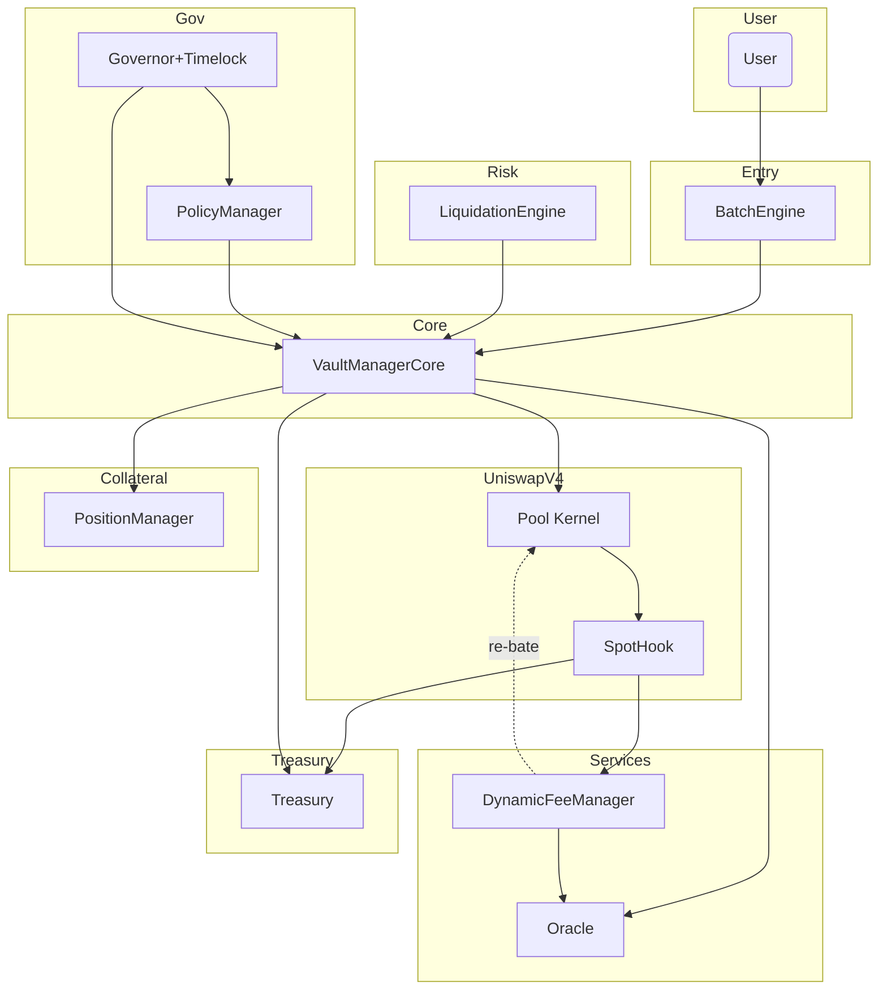
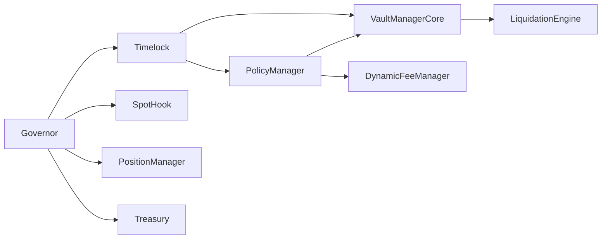
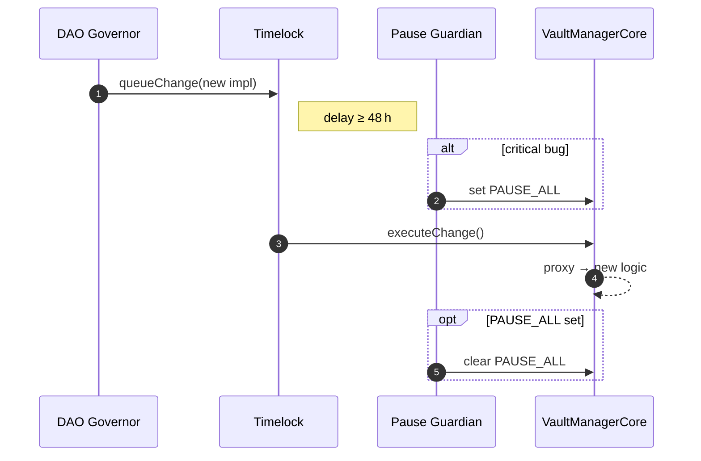

# Appendix A – Diagram Assets

## A.1 Module Graph (`diagrams/module_graph.mmd`)



### A.2 Roles & Governance Graph (`diagrams/roles_graph.mmd`)



\### A.2 Roles & Permissions Graph (updated)

```mermaid
graph LR
    GOV[Governor (DAO)] -->|queues tx| TIM[Timelock]
    TIM -->|executes after delay| VMC[VaultManager Core]
    TIM --> POLM[PoolPolicyManager]
    TIM --> LENS[VaultMetricsLens]
    GOV --> TSWY[Treasury]
    GOV --> SH[Spot Hook]
    GOV --> PM[PositionManager]
    PG[Pause Guardian] --|toggle pauseFlags| VMC
    PG --|cancel queue| TIM
```

\### A.3 Upgrade Sequence (normal + emergency pause)



