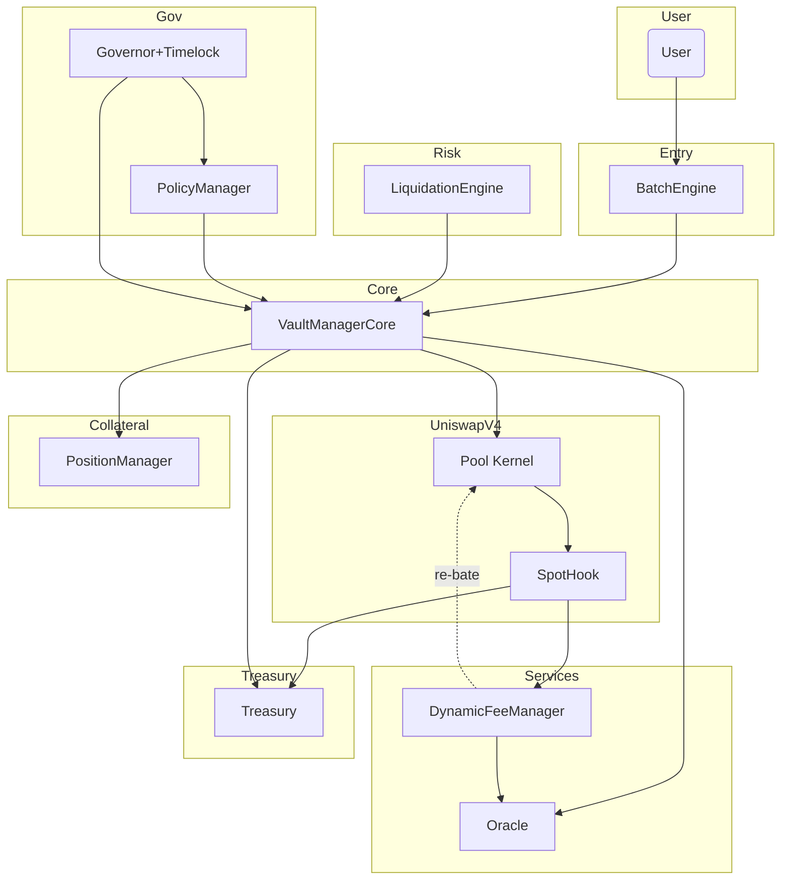
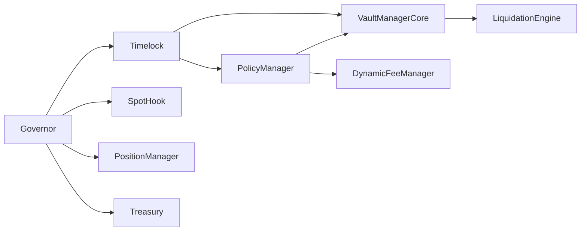

# Appendix A – Diagram Assets

## A.1 Module Graph (`diagrams/module_graph.mmd`)

```mermaid
graph TD
    subgraph User
        U(User)
    end
    subgraph Entry
        BE[BatchEngine]
    end
    subgraph Core
        VMC[VaultManagerCore]
    end
    subgraph UniswapV4
        P[Pool Kernel]
        SH[SpotHook]
    end
    subgraph Services
        DFM[DynamicFeeManager]
        ORA[Oracle]
    end
    subgraph Collateral
        PM[PositionManager]
    end
    subgraph Risk
        LQ[LiquidationEngine]
    end
    subgraph Gov
        GOV[Governor+Timelock]
        POL[PolicyManager]
    end
    subgraph Treasury
        TSWY[Treasury]
    end

    U --> BE --> VMC
    VMC --> P
    P --> SH
    SH --> DFM
    DFM -.re‑bate.-> P
    SH --> TSWY
    VMC --> ORA
    DFM --> ORA
    VMC --> PM
    LQ --> VMC
    GOV --> POL --> VMC
    GOV --> VMC
    VMC --> TSWY
```

### A.2 Roles & Governance Graph (`diagrams/roles_graph.mmd`)

```mermaid
graph LR
    GOV[Governor] --> TIM[Timelock]
    TIM --> POL[PolicyManager]
    TIM --> VMC[VaultManagerCore]
    POL --> VMC
    GOV --> SH[SpotHook]
    GOV --> PM[PositionManager]
    GOV --> TSWY[Treasury]
    POL --> DFM[DynamicFeeManager]
    VMC --> LQ[LiquidationEngine]
```
